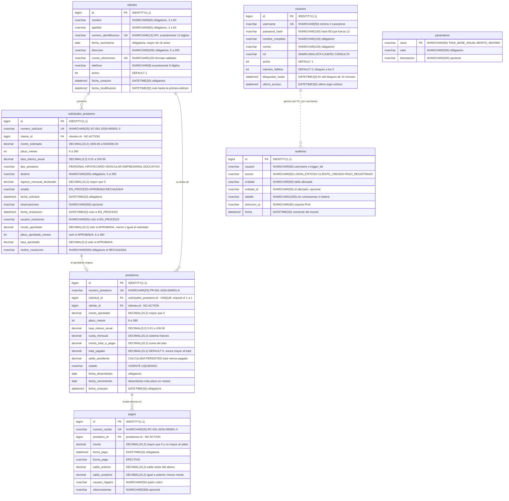
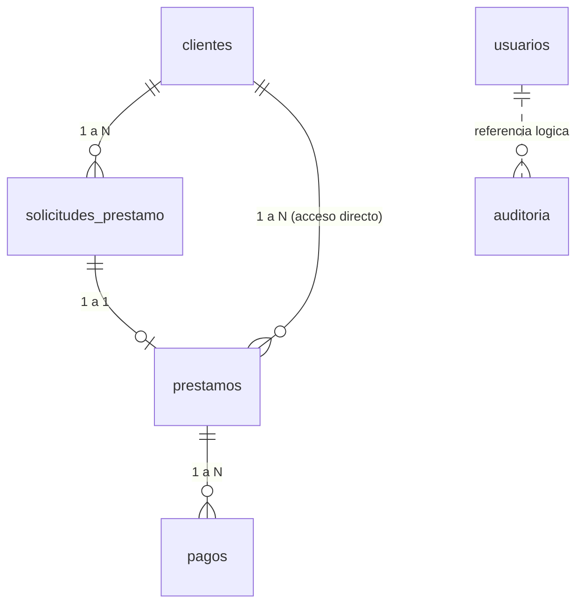

# Diagrama entidad-relación — CHN_Prestamos

Motor: **SQL Server 2022** · Esquema: **dbo** · Moneda: **GTQ**

Contenido de este documento:

1. [Diagrama completo (Mermaid)](#1-diagrama-completo)
2. [Diagrama simplificado de relaciones (Mermaid)](#2-diagrama-simplificado-de-relaciones)
3. [Descripción de cada relación y su regla de integridad](#3-relaciones-y-reglas-de-integridad)
4. [Diccionario de datos](#4-diccionario-de-datos)
5. [Modelo en DBML (para dbdiagram.io)](#5-modelo-en-dbml)

---

## 1. Diagrama completo

> Los tipos exactos de SQL Server van en el comentario de cada atributo y en el
> [diccionario de datos](#4-diccionario-de-datos). `PK` = llave primaria,
> `FK` = llave foránea, `UK` = restricción única.



---

## 2. Diagrama simplificado de relaciones

Solo el flujo del negocio, sin columnas:



Leído en una línea:

```
cliente ──1:N──► solicitud ──1:1──► préstamo ──1:N──► pagos
   │                (si es aprobada)     ▲
   └──────────── 1:N ────────────────────┘
```

---

## 3. Relaciones y reglas de integridad

### 3.1 `clientes` **1 : N** `solicitudes_prestamo`

- **FK:** `fk_solicitudes_cliente` → `solicitudes_prestamo.cliente_id` → `clientes.id`
- **Cardinalidad:** un cliente puede presentar **0 o muchas** solicitudes; cada solicitud
  pertenece a **exactamente un** cliente (`cliente_id NOT NULL`).
- **Integridad:** `ON DELETE NO ACTION` / `ON UPDATE NO ACTION`. No se puede borrar un
  cliente que tenga solicitudes: primero las borra el caso de uso, en orden.
- **Regla de negocio:** no hay límite de solicitudes por cliente, pero el evaluador de
  capacidad de pago **no recomienda** aprobar si el cliente ya tiene 3 o más préstamos
  vigentes.

### 3.2 `solicitudes_prestamo` **1 : 1** `prestamos`

- **FK:** `fk_prestamos_solicitud` → `prestamos.solicitud_id` → `solicitudes_prestamo.id`
- **UNIQUE:** `uq_prestamos_solicitud` sobre `prestamos.solicitud_id`. Es lo que convierte
  la relación en **1 a 1**: una solicitud no puede originar dos préstamos.
- **Cardinalidad:** una solicitud origina **0 o 1** préstamo. Solo las `APROBADA` llegan a
  desembolso; las `EN_PROCESO` y las `RECHAZADA` nunca tienen préstamo.
- **Integridad:** `NO ACTION`. Además, `ck_solicitudes_coherencia_resolucion` garantiza
  que una solicitud `APROBADA` traiga monto, plazo y tasa aprobados, que son justamente
  los datos con los que nace el préstamo.
- **Regla de negocio:** una solicitud resuelta (aprobada o rechazada) **no admite cambios
  de estado**; el intento produce `ReglaNegocioException` → HTTP 409.

### 3.3 `clientes` **1 : N** `prestamos`

- **FK:** `fk_prestamos_cliente` → `prestamos.cliente_id` → `clientes.id`
- **Cardinalidad:** un cliente puede tener **0 o muchos** préstamos.
- **Por qué existe:** `cliente_id` es redundante (se podría llegar al cliente por
  `solicitud_id`). Se **desnormaliza a propósito**: los listados de cartera, el conteo de
  préstamos vigentes por cliente y el filtro `GET /prestamos?clienteId=` son las consultas
  más frecuentes del sistema, y así se resuelven con un solo índice y sin JOIN adicional.
- **Integridad:** `NO ACTION`. Este segundo camino de `clientes` hacia `pagos` es
  precisamente el que obliga a que **ninguna** FK sea en cascada (ver
  [política de borrado](README.md#5-política-de-borrado-cascada-explícita-no-del-motor)).

### 3.4 `prestamos` **1 : N** `pagos`

- **FK:** `fk_pagos_prestamo` → `pagos.prestamo_id` → `prestamos.id`
- **Cardinalidad:** un préstamo recibe **0 o muchos** pagos; cada pago pertenece a
  **exactamente un** préstamo.
- **Integridad:** `NO ACTION`. Un préstamo con pagos no se puede borrar directamente.
- **Reglas de negocio (dominio + `CHECK`):**
  - `monto > 0` y **nunca mayor al saldo pendiente** (si excede, `ReglaNegocioException`
    con el saldo disponible en el mensaje → HTTP 409).
  - No se admiten pagos sobre un préstamo `LIQUIDADO`.
  - `saldo_posterior = saldo_anterior - monto` (`ck_pagos_aritmetica`).
  - Al aplicar el pago, `total_pagado` sube y, si el saldo llega a 0, el préstamo pasa a
    `LIQUIDADO`. `ck_prestamos_liquidado` impide que el estado mienta.

### 3.5 `usuarios` ⇢ `auditoria` (referencia lógica, **sin** FK)

- **Cardinalidad:** un usuario genera **0 o muchos** registros de auditoría.
- **Por qué sin FK:** `auditoria.usuario` guarda el `username` como **texto histórico**. Si
  un usuario se diera de baja, la traza debe sobrevivir intacta; una FK lo impediría o
  arrastraría la bitácora. Además la base escribe ahí con el valor `trigger_bd`, que no
  es un usuario de la tabla.
- **Integridad:** la garantiza la aplicación al escribir siempre el usuario autenticado.
  La tabla es de **solo inserción y consulta**.

### 3.6 `parametros` (tabla independiente)

Catálogo clave/valor sin relaciones. Publica los límites del negocio para consulta y
reportes.

---

## 4. Diccionario de datos

### 4.1 `dbo.clientes`

| # | Columna | Tipo | Nulo | Llave | Regla / valor por omisión |
|---|---|---|---|---|---|
| 1 | `id` | `BIGINT IDENTITY(1,1)` | No | PK | — |
| 2 | `nombre` | `NVARCHAR(60)` | No | | 2 a 60 caracteres, con `TRIM` |
| 3 | `apellido` | `NVARCHAR(60)` | No | | 2 a 60 caracteres, con `TRIM` |
| 4 | `numero_identificacion` | `NVARCHAR(13)` | No | UK | DPI: exactamente 13 dígitos |
| 5 | `fecha_nacimiento` | `DATE` | No | | No futura; el titular debe tener 18 años o más |
| 6 | `direccion` | `NVARCHAR(200)` | No | | 5 a 200 caracteres |
| 7 | `correo_electronico` | `NVARCHAR(120)` | No | UK | Formato `algo@algo.xx`, normalizado a minúsculas |
| 8 | `telefono` | `NVARCHAR(8)` | No | | Exactamente 8 dígitos (Guatemala) |
| 9 | `activo` | `BIT` | No | | `DEFAULT 1` |
| 10 | `fecha_creacion` | `DATETIME2(0)` | No | | Se asigna al registrar |
| 11 | `fecha_modificacion` | `DATETIME2(0)` | Sí | | Nunca anterior a `fecha_creacion` |

### 4.2 `dbo.solicitudes_prestamo`

| # | Columna | Tipo | Nulo | Llave | Regla / valor por omisión |
|---|---|---|---|---|---|
| 1 | `id` | `BIGINT IDENTITY(1,1)` | No | PK | — |
| 2 | `numero_solicitud` | `NVARCHAR(25)` | No | UK | `SC-001-2026-000001-3` (`seq_solicitud`) |
| 3 | `cliente_id` | `BIGINT` | No | FK | → `clientes(id)`, `NO ACTION` |
| 4 | `monto_solicitado` | `DECIMAL(15,2)` | No | | 1 000.00 a 5 000 000.00 |
| 5 | `plazo_meses` | `INT` | No | | 6 a 360 |
| 6 | `tasa_interes_anual` | `DECIMAL(5,2)` | No | | 0.01 a 100.00 (% anual) |
| 7 | `tipo_prestamo` | `NVARCHAR(20)` | No | | `PERSONAL`, `HIPOTECARIO`, `VEHICULAR`, `EMPRESARIAL`, `EDUCATIVO`, en mayúsculas exactas (cotejo binario desde `V5`) |
| 8 | `destino` | `NVARCHAR(200)` | No | | 5 a 200 caracteres |
| 9 | `ingreso_mensual_declarado` | `DECIMAL(15,2)` | No | | Mayor que 0 |
| 10 | `estado` | `NVARCHAR(15)` | No | | `EN_PROCESO`, `APROBADA`, `RECHAZADA` |
| 11 | `fecha_solicitud` | `DATETIME2(0)` | No | | Se asigna al crear |
| 12 | `observaciones` | `NVARCHAR(500)` | Sí | | Notas del analista |
| 13 | `fecha_resolucion` | `DATETIME2(0)` | Sí | | No anterior a `fecha_solicitud` |
| 14 | `usuario_resolucion` | `NVARCHAR(50)` | Sí | | Quién resolvió |
| 15 | `monto_aprobado` | `DECIMAL(15,2)` | Sí | | Solo si `APROBADA`; `> 0` y `≤ monto_solicitado` |
| 16 | `plazo_aprobado_meses` | `INT` | Sí | | Solo si `APROBADA`; 6 a 360 |
| 17 | `tasa_aprobada` | `DECIMAL(5,2)` | Sí | | Solo si `APROBADA`; 0.01 a 100.00 |
| 18 | `motivo_resolucion` | `NVARCHAR(500)` | Sí | | **Obligatorio (10 a 500) si `RECHAZADA`**; opcional si `APROBADA` |

### 4.3 `dbo.prestamos`

| # | Columna | Tipo | Nulo | Llave | Regla / valor por omisión |
|---|---|---|---|---|---|
| 1 | `id` | `BIGINT IDENTITY(1,1)` | No | PK | — |
| 2 | `numero_prestamo` | `NVARCHAR(25)` | No | UK | `PR-001-2026-000001-9` (`seq_prestamo`) |
| 3 | `solicitud_id` | `BIGINT` | No | FK + UK | → `solicitudes_prestamo(id)`. El `UNIQUE` impone el 1 a 1 |
| 4 | `cliente_id` | `BIGINT` | No | FK | → `clientes(id)`. Desnormalizado para los listados de cartera |
| 5 | `monto_aprobado` | `DECIMAL(15,2)` | No | | Mayor que 0 |
| 6 | `plazo_meses` | `INT` | No | | 6 a 360 |
| 7 | `tasa_interes_anual` | `DECIMAL(5,2)` | No | | 0.01 a 100.00 |
| 8 | `cuota_mensual` | `DECIMAL(15,2)` | No | | Sistema francés (`dbo.fn_calcular_cuota`) |
| 9 | `monto_total_a_pagar` | `DECIMAL(15,2)` | No | | Suma del plan de amortización, con la última cuota ajustada (`dbo.fn_total_plan`); puede diferir en centavos de `cuota_mensual × plazo_meses` |
| 10 | `total_pagado` | `DECIMAL(15,2)` | No | | `DEFAULT 0`; entre 0 y `monto_total_a_pagar` |
| 11 | `saldo_pendiente` | `DECIMAL(15,2)` **calculada `PERSISTED`** | No | | `monto_total_a_pagar - total_pagado`. No se escribe |
| 12 | `estado` | `NVARCHAR(15)` | No | | `VIGENTE`, `LIQUIDADO`. `LIQUIDADO` exige saldo 0 |
| 13 | `fecha_desembolso` | `DATE` | No | | Fecha de entrega del dinero |
| 14 | `fecha_vencimiento` | `DATE` | No | | `fecha_desembolso + plazo_meses`; siempre posterior |
| 15 | `fecha_creacion` | `DATETIME2(0)` | No | | Se asigna al desembolsar |

### 4.4 `dbo.pagos`

| # | Columna | Tipo | Nulo | Llave | Regla / valor por omisión |
|---|---|---|---|---|---|
| 1 | `id` | `BIGINT IDENTITY(1,1)` | No | PK | — |
| 2 | `numero_recibo` | `NVARCHAR(25)` | No | UK | `RC-001-2026-000001-4` (`seq_recibo`) |
| 3 | `prestamo_id` | `BIGINT` | No | FK | → `prestamos(id)`, `NO ACTION` |
| 4 | `monto` | `DECIMAL(15,2)` | No | | Mayor que 0 y no mayor al saldo pendiente |
| 5 | `fecha_pago` | `DATETIME2(0)` | No | | Momento del cobro |
| 6 | `forma_pago` | `NVARCHAR(15)` | No | | `EFECTIVO` |
| 7 | `saldo_anterior` | `DECIMAL(15,2)` | No | | Saldo antes del abono (≥ 0) |
| 8 | `saldo_posterior` | `DECIMAL(15,2)` | No | | `= saldo_anterior - monto` (≥ 0) |
| 9 | `usuario_registro` | `NVARCHAR(50)` | No | | Cajero que registró el pago |
| 10 | `observaciones` | `NVARCHAR(300)` | Sí | | Nota del recibo |

### 4.5 `dbo.usuarios`

| # | Columna | Tipo | Nulo | Llave | Regla / valor por omisión |
|---|---|---|---|---|---|
| 1 | `id` | `BIGINT IDENTITY(1,1)` | No | PK | — |
| 2 | `username` | `NVARCHAR(50)` | No | UK | Mínimo 3 caracteres |
| 3 | `password_hash` | `NVARCHAR(100)` | No | | **Solo** hash BCrypt (fuerza 12) |
| 4 | `nombre_completo` | `NVARCHAR(120)` | No | | — |
| 5 | `correo` | `NVARCHAR(120)` | No | | Formato `algo@algo.xx` |
| 6 | `rol` | `NVARCHAR(15)` | No | | `ADMIN`, `ANALISTA`, `CAJERO`, `CONSULTA` |
| 7 | `activo` | `BIT` | No | | `DEFAULT 1` |
| 8 | `intentos_fallidos` | `INT` | No | | `DEFAULT 0`; a los 5 se bloquea la cuenta |
| 9 | `bloqueado_hasta` | `DATETIME2(0)` | Sí | | Fin del bloqueo (15 minutos) |
| 10 | `ultimo_acceso` | `DATETIME2(0)` | Sí | | Último inicio de sesión correcto |

### 4.6 `dbo.auditoria`

| # | Columna | Tipo | Nulo | Llave | Regla / valor por omisión |
|---|---|---|---|---|---|
| 1 | `id` | `BIGINT IDENTITY(1,1)` | No | PK | — |
| 2 | `usuario` | `NVARCHAR(50)` | No | | `username` del operador, o `trigger_bd` |
| 3 | `accion` | `NVARCHAR(50)` | No | | `LOGIN_EXITOSO`, `CLIENTE_CREADO`, `SOLICITUD_APROBADA`, `PAGO_REGISTRADO`, `CLIENTE_ELIMINADO_BD`, … |
| 4 | `entidad` | `NVARCHAR(50)` | No | | Tabla o agregado afectado |
| 5 | `entidad_id` | `NVARCHAR(50)` | Sí | | Identificador afectado |
| 6 | `detalle` | `NVARCHAR(1000)` | Sí | | Resumen legible. **Nunca contraseñas ni tokens** |
| 7 | `direccion_ip` | `NVARCHAR(45)` | Sí | | Soporta IPv6 |
| 8 | `fecha` | `DATETIME2(0)` | No | | Momento del evento |

### 4.7 `dbo.parametros`

| # | Columna | Tipo | Nulo | Llave | Regla / valor por omisión |
|---|---|---|---|---|---|
| 1 | `clave` | `NVARCHAR(50)` | No | PK | `TASA_BASE_ANUAL`, `MONTO_MINIMO`, `MONEDA`, … |
| 2 | `valor` | `NVARCHAR(200)` | No | | No vacío |
| 3 | `descripcion` | `NVARCHAR(200)` | Sí | | Para qué sirve el parámetro |

### 4.8 Objetos de apoyo

| Objeto | Tipo | Propósito |
|---|---|---|
| `dbo.seq_solicitud` | Secuencia `BIGINT` | Correlativo `SC-001-2026-######` |
| `dbo.seq_prestamo` | Secuencia `BIGINT` | Correlativo `PR-001-2026-######` |
| `dbo.seq_recibo` | Secuencia `BIGINT` | Correlativo `RC-001-2026-######` |
| `dbo.fn_calcular_cuota` | Función escalar | Cuota por sistema francés |
| `dbo.fn_total_plan` | Función escalar | Total a pagar: suma real del plan, con la última cuota ajustada (no cuota × plazo) |
| `dbo.vw_resumen_general` | Vista | Indicadores del tablero (una fila) |
| `dbo.vw_prestamos_saldo` | Vista | Cartera con saldo y avance de pago |
| `dbo.vw_solicitudes_detalle` | Vista | Solicitudes con cliente y resolución |
| `dbo.vw_cartera_por_tipo` | Vista (`V4`) | Cartera del tablero por tipo de préstamo: une `prestamos` con `solicitudes_prestamo` por `solicitud_id` (1 a 1) |
| `dbo.vw_recaudacion_mensual` | Vista (`V4`) | Pagos del tablero agrupados por año y mes de `fecha_pago` |
| `dbo.sp_estado_cuenta_prestamo` | Procedimiento | Estado de cuenta de un préstamo |
| `dbo.sp_historial_pagos_cliente` | Procedimiento | Pagos de todos los préstamos de un cliente |
| `dbo.tr_clientes_auditoria_delete` | Trigger `AFTER DELETE` | Traza del borrado de clientes |

---

## 5. Modelo en DBML

Para abrirlo en [dbdiagram.io](https://dbdiagram.io): copiar el bloque y pegarlo en el
editor.

```dbml
// =============================================================================
// CHN_Prestamos - Sistema de Gestion de Prestamos Bancarios
// SQL Server 2022, esquema dbo. Todas las FK son NO ACTION: el borrado en
// cascada de un cliente lo ejecuta la aplicacion en orden explicito.
// =============================================================================

Table clientes {
  id                    bigint        [pk, increment]
  nombre                nvarchar(60)  [not null]
  apellido              nvarchar(60)  [not null]
  numero_identificacion nvarchar(13)  [not null, unique, note: 'DPI: 13 digitos']
  fecha_nacimiento      date          [not null, note: 'Mayor de 18 anios']
  direccion             nvarchar(200) [not null]
  correo_electronico    nvarchar(120) [not null, unique]
  telefono              nvarchar(8)   [not null, note: '8 digitos']
  activo                bit           [not null, default: 1]
  fecha_creacion        datetime2     [not null]
  fecha_modificacion    datetime2

  indexes {
    (apellido, nombre) [name: 'ix_clientes_apellido_nombre']
    activo             [name: 'ix_clientes_activo']
    fecha_creacion     [name: 'ix_clientes_fecha_creacion']
  }
  note: 'Titulares del credito. El DPI es su identificador natural.'
}

Table solicitudes_prestamo {
  id                        bigint        [pk, increment]
  numero_solicitud          nvarchar(25)  [not null, unique, note: 'SC-001-2026-000001-3']
  cliente_id                bigint        [not null, ref: > clientes.id]
  monto_solicitado          decimal(15,2) [not null, note: '1000.00 a 5000000.00']
  plazo_meses               int           [not null, note: '6 a 360']
  tasa_interes_anual        decimal(5,2)  [not null, note: '0.01 a 100.00']
  tipo_prestamo             nvarchar(20)  [not null, note: 'PERSONAL|HIPOTECARIO|VEHICULAR|EMPRESARIAL|EDUCATIVO']
  destino                   nvarchar(200) [not null]
  ingreso_mensual_declarado decimal(15,2) [not null, note: '> 0']
  estado                    nvarchar(15)  [not null, note: 'EN_PROCESO|APROBADA|RECHAZADA']
  fecha_solicitud           datetime2     [not null]
  observaciones             nvarchar(500)
  fecha_resolucion          datetime2     [note: 'Nulo si EN_PROCESO']
  usuario_resolucion        nvarchar(50)  [note: 'Nulo si EN_PROCESO']
  monto_aprobado            decimal(15,2) [note: 'Solo si APROBADA, <= monto_solicitado']
  plazo_aprobado_meses      int           [note: 'Solo si APROBADA']
  tasa_aprobada             decimal(5,2)  [note: 'Solo si APROBADA']
  motivo_resolucion         nvarchar(500) [note: 'Obligatorio si RECHAZADA']

  indexes {
    (cliente_id, fecha_solicitud) [name: 'ix_solicitudes_cliente']
    estado                        [name: 'ix_solicitudes_estado']
    fecha_solicitud               [name: 'ix_solicitudes_fecha']
  }
  note: 'Solicitudes con su resolucion (usuario, fecha y motivo) en la misma fila.'
}

Table prestamos {
  id                  bigint        [pk, increment]
  numero_prestamo     nvarchar(25)  [not null, unique, note: 'PR-001-2026-000001-9']
  solicitud_id        bigint        [not null, unique, ref: - solicitudes_prestamo.id]
  cliente_id          bigint        [not null, ref: > clientes.id]
  monto_aprobado      decimal(15,2) [not null]
  plazo_meses         int           [not null]
  tasa_interes_anual  decimal(5,2)  [not null]
  cuota_mensual       decimal(15,2) [not null, note: 'Sistema frances']
  monto_total_a_pagar decimal(15,2) [not null, note: 'Suma del plan con la ultima cuota ajustada (fn_total_plan)']
  total_pagado        decimal(15,2) [not null, default: 0]
  saldo_pendiente     decimal(15,2) [not null, note: 'CALCULADA PERSISTED: total - pagado']
  estado              nvarchar(15)  [not null, note: 'VIGENTE|LIQUIDADO']
  fecha_desembolso    date          [not null]
  fecha_vencimiento   date          [not null, note: 'desembolso + plazo_meses']
  fecha_creacion      datetime2     [not null]

  indexes {
    (cliente_id, estado) [name: 'ix_prestamos_cliente_estado']
    estado               [name: 'ix_prestamos_estado']
    fecha_desembolso     [name: 'ix_prestamos_fecha_desembolso']
    fecha_vencimiento    [name: 'ix_prestamos_fecha_vencimiento']
  }
  note: 'Un prestamo por solicitud aprobada (solicitud_id es UNIQUE).'
}

Table pagos {
  id               bigint        [pk, increment]
  numero_recibo    nvarchar(25)  [not null, unique, note: 'RC-001-2026-000001-4']
  prestamo_id      bigint        [not null, ref: > prestamos.id]
  monto            decimal(15,2) [not null, note: '> 0 y <= saldo pendiente']
  fecha_pago       datetime2     [not null]
  forma_pago       nvarchar(15)  [not null, note: 'EFECTIVO']
  saldo_anterior   decimal(15,2) [not null]
  saldo_posterior  decimal(15,2) [not null, note: '= saldo_anterior - monto']
  usuario_registro nvarchar(50)  [not null]
  observaciones    nvarchar(300)

  indexes {
    (prestamo_id, fecha_pago) [name: 'ix_pagos_prestamo']
    fecha_pago                [name: 'ix_pagos_fecha']
  }
  note: 'Recibos. Los saldos son el corte historico del documento emitido.'
}

Table usuarios {
  id                bigint        [pk, increment]
  username          nvarchar(50)  [not null, unique]
  password_hash     nvarchar(100) [not null, note: 'Hash BCrypt fuerza 12, nunca texto plano']
  nombre_completo   nvarchar(120) [not null]
  correo            nvarchar(120) [not null]
  rol               nvarchar(15)  [not null, note: 'ADMIN|ANALISTA|CAJERO|CONSULTA']
  activo            bit           [not null, default: 1]
  intentos_fallidos int           [not null, default: 0]
  bloqueado_hasta   datetime2     [note: 'Bloqueo de 15 min tras 5 intentos']
  ultimo_acceso     datetime2

  indexes {
    rol [name: 'ix_usuarios_rol']
  }
  note: 'Operadores del sistema. Los crea la aplicacion al arrancar.'
}

Table auditoria {
  id           bigint         [pk, increment]
  usuario      nvarchar(50)   [not null, note: 'username o trigger_bd']
  accion       nvarchar(50)   [not null]
  entidad      nvarchar(50)   [not null]
  entidad_id   nvarchar(50)
  detalle      nvarchar(1000) [note: 'Sin contrasenas ni tokens']
  direccion_ip nvarchar(45)
  fecha        datetime2      [not null]

  indexes {
    fecha                 [name: 'ix_auditoria_fecha']
    (usuario, fecha)      [name: 'ix_auditoria_usuario']
    (entidad, entidad_id) [name: 'ix_auditoria_entidad']
  }
  note: 'Bitacora de solo insercion. Sin FK a usuarios: la traza sobrevive a la baja del usuario.'
}

Table parametros {
  clave       nvarchar(50)  [pk]
  valor       nvarchar(200) [not null]
  descripcion nvarchar(200)
  note: 'Parametros de negocio no sensibles.'
}
```

> En DBML, `ref: >` es "muchos a uno" y `ref: -` es "uno a uno". La relación
> `prestamos.solicitud_id - solicitudes_prestamo.id` se declara como 1 a 1 porque en SQL
> Server esa columna lleva además una restricción `UNIQUE`.
