# Manual de usuario

## Sistema de Gestión de Préstamos

**Crédito Hipotecario Nacional de Guatemala**

Este manual explica, paso a paso y con imágenes de la pantalla real, cómo usar el Sistema de Gestión de Préstamos. Está escrito para el personal de agencia y de oficinas centrales; no necesita conocimientos técnicos para seguirlo.

Con el sistema usted puede:

- Registrar y consultar el expediente de los clientes.
- Recibir solicitudes de préstamo, simular la cuota y evaluar la capacidad de pago del cliente.
- Aprobar o rechazar solicitudes, con la resolución registrada y firmada por su usuario.
- Consultar los préstamos aprobados, su saldo pendiente y su plan de cuotas.
- Registrar los pagos recibidos en efectivo e imprimir el comprobante del cliente.
- Consultar la bitácora de auditoría de las operaciones realizadas.

### Qué puede hacer cada perfil

| Acción | Administrador | Analista de crédito | Cajero | Consulta |
|---|:---:|:---:|:---:|:---:|
| Consultar clientes, solicitudes, préstamos y pagos | Sí | Sí | Sí | Sí |
| Registrar un cliente nuevo | Sí | Sí | No | No |
| Editar los datos de contacto de un cliente | Sí | Sí | No | No |
| Eliminar un cliente | Sí | No | No | No |
| Registrar una solicitud de préstamo | Sí | Sí | No | No |
| Simular la cuota y la capacidad de pago | Sí | Sí | No | No |
| Aprobar o rechazar una solicitud | Sí | Sí | No | No |
| Registrar un pago en efectivo | Sí | No | Sí | No |
| Imprimir el comprobante de un pago | Sí | Sí | Sí | Sí |
| Ver la bitácora de auditoría | Sí | No | No | No |

> **Nota.** El sistema oculta los botones de las acciones que su perfil no tiene autorizadas. Si no encuentra un botón, lo más probable es que su perfil no permita esa operación; consulte la tabla anterior.

---

## Índice

- [Antes de empezar](#antes-de-empezar)
  - [Cómo leer un número oficial](#cómo-leer-un-número-oficial)
- [1. Ingresar al sistema](#1-ingresar-al-sistema)
- [2. Conocer la pantalla principal](#2-conocer-la-pantalla-principal)
- [3. Filtrar y buscar en los listados](#3-filtrar-y-buscar-en-los-listados)
  - [3.1 El panel de filtros, paso a paso](#31-el-panel-de-filtros-paso-a-paso)
  - [3.2 Qué puede filtrar en cada pantalla](#32-qué-puede-filtrar-en-cada-pantalla)
  - [3.3 La búsqueda rápida de clientes](#33-la-búsqueda-rápida-de-clientes)
  - [3.4 Elegir en una lista desplegable](#34-elegir-en-una-lista-desplegable)
- [4. Elegir una fecha](#4-elegir-una-fecha)
  - [4.1 Escribir la fecha o usar el calendario](#41-escribir-la-fecha-o-usar-el-calendario)
  - [4.2 Indicar un periodo «del … al …»](#42-indicar-un-periodo-del--al-)
- [5. El color de los botones](#5-el-color-de-los-botones)
- [6. Gestionar clientes](#6-gestionar-clientes)
  - [6.1 Consultar y buscar clientes](#61-consultar-y-buscar-clientes)
  - [6.2 Registrar un cliente nuevo](#62-registrar-un-cliente-nuevo)
  - [6.3 Editar un cliente](#63-editar-un-cliente)
  - [6.4 Consultar la ficha completa](#64-consultar-la-ficha-completa)
  - [6.5 Eliminar un cliente](#65-eliminar-un-cliente)
- [7. Solicitudes de préstamo](#7-solicitudes-de-préstamo)
  - [7.1 Consultar el estado de las solicitudes](#71-consultar-el-estado-de-las-solicitudes)
  - [7.2 Registrar una solicitud nueva](#72-registrar-una-solicitud-nueva)
  - [7.3 Simular antes de enviar](#73-simular-antes-de-enviar)
  - [7.4 Aprobar una solicitud](#74-aprobar-una-solicitud)
  - [7.5 Rechazar una solicitud](#75-rechazar-una-solicitud)
  - [7.6 Consultar la resolución](#76-consultar-la-resolución)
- [8. Préstamos aprobados](#8-préstamos-aprobados)
  - [8.1 Consultar la cartera de préstamos](#81-consultar-la-cartera-de-préstamos)
  - [8.2 El detalle del préstamo](#82-el-detalle-del-préstamo)
  - [8.3 El plan de amortización](#83-el-plan-de-amortización)
- [9. Registrar pagos en efectivo](#9-registrar-pagos-en-efectivo)
  - [9.1 Registrar un pago](#91-registrar-un-pago)
  - [9.2 Imprimir el comprobante](#92-imprimir-el-comprobante)
  - [9.3 Consultar el historial de pagos](#93-consultar-el-historial-de-pagos)
  - [9.4 Cuando el préstamo queda liquidado](#94-cuando-el-préstamo-queda-liquidado)
- [10. Bitácora de auditoría](#10-bitácora-de-auditoría)
- [11. Uso desde el teléfono](#11-uso-desde-el-teléfono)
- [12. Preguntas frecuentes](#12-preguntas-frecuentes)
- [13. Mensajes del sistema](#13-mensajes-del-sistema)
- [14. Glosario](#14-glosario)

---

## Antes de empezar

Para trabajar con el sistema solo necesita:

1. Una computadora con un navegador de internet actualizado (Google Chrome, Microsoft Edge o Mozilla Firefox).
2. La dirección del sistema: **http://localhost:8080**. Escríbala en la barra de direcciones del navegador y pulse Intro.
3. Su usuario y su contraseña, entregados por el administrador del sistema.

No hay que instalar ningún programa. El sistema funciona dentro del navegador.

> **Importante.** Las contraseñas que aparecen en la pantalla de ingreso son **cuentas de demostración**, creadas únicamente para la evaluación del sistema. Antes de usar el sistema con información real, el administrador debe cambiar esas contraseñas o eliminar esas cuentas. Nunca comparta su usuario ni su contraseña con otra persona: todas las operaciones quedan registradas a nombre de quien las hizo.

Recomendaciones de uso:

- Los importes siempre se muestran en quetzales, con el formato **Q 1,234.56**.
- Las fechas se muestran **y se escriben** con el formato **dd/mm/aaaa**; por ejemplo, 18/04/2026. Todos los campos de fecha llevan además un calendario, explicado en la [sección 4](#4-elegir-una-fecha).
- Los listados se consultan siempre con el mismo panel de filtros, explicado en la [sección 3](#3-filtrar-y-buscar-en-los-listados).
- El **color** de los botones y de los avisos tiene un significado fijo en todo el sistema: consúltelo en las secciones [5](#5-el-color-de-los-botones) y [13](#13-mensajes-del-sistema).
- Cierre su sesión al terminar, sobre todo si comparte la computadora con otras personas.

### Cómo leer un número oficial

Cada solicitud, préstamo y recibo recibe un número oficial único, que es el que se cita al cliente y el que aparece en los comprobantes y reportes. Se lee por bloques, de izquierda a derecha:

| `PR` | `001` | `2026` | `000004` | `3` |
|:---:|:---:|:---:|:---:|:---:|
| Tipo de documento | Agencia | Año | Correlativo | Dígito verificador |

- **Tipo de documento.** `SC` es una solicitud de crédito, `PR` un préstamo y `RC` un recibo de caja (el respaldo de un pago en efectivo).
- **Agencia.** La oficina que emitió el documento; `001` corresponde a las oficinas centrales.
- **Año y correlativo.** El año de emisión y el número consecutivo del documento; el ejemplo es el cuarto préstamo.
- **Dígito verificador.** Se calcula con los demás dígitos. Si al copiar un número se equivoca en un dígito, el número deja de corresponder a cualquier documento, en lugar de señalar el de otro cliente.

Para buscar un documento no hace falta escribir el número completo: basta con una parte, por ejemplo `000004` o `PR-001-2026`.

---

## 1. Ingresar al sistema

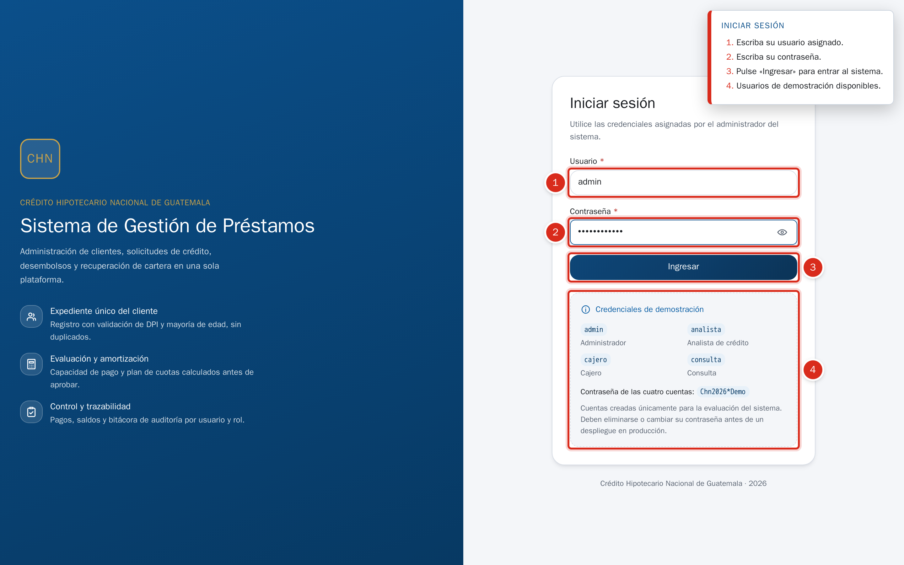
*Figura 1. Pantalla de ingreso al sistema.*

Siga estos pasos, que corresponden a los números señalados en la Figura 1:

1. **Escriba su usuario asignado** en el campo *Usuario*. Por ejemplo: `analista`.
2. **Escriba su contraseña** en el campo *Contraseña*. Si desea comprobar lo que escribió, pulse el icono del ojo que está al lado derecho del campo para mostrar u ocultar los caracteres.
3. **Pulse el botón «Ingresar»** para entrar al sistema. Si los datos son correctos, el sistema lo saluda con su nombre y lo lleva a la pantalla principal.
4. **Usuarios de demostración disponibles.** El recuadro inferior de la tarjeta enumera las cuentas creadas para la evaluación del sistema, con el perfil que corresponde a cada una.

### Usuarios de demostración

| Usuario | Perfil | Contraseña |
|---|---|---|
| `admin` | Administrador | `Chn2026*Demo` |
| `analista` | Analista de crédito | `Chn2026*Demo` |
| `cajero` | Cajero | `Chn2026*Demo` |
| `consulta` | Consulta | `Chn2026*Demo` |

> **Advertencia.** Estas cuentas existen solo para probar el sistema. Sus contraseñas deben cambiarse antes de usar el sistema con clientes reales.

### Si la cuenta queda bloqueada

Por seguridad, el sistema bloquea la cuenta cuando se escribe mal la contraseña **cinco veces seguidas**. Durante el bloqueo, aunque escriba la contraseña correcta, el sistema no lo dejará entrar y mostrará el aviso *«La cuenta está bloqueada temporalmente por intentos fallidos»*.

Qué hacer:

- **Espere 15 minutos** y vuelva a intentarlo con calma; el bloqueo se levanta solo.
- Si no recuerda su contraseña o necesita entrar de inmediato, **pida apoyo al administrador del sistema** para que la restablezca.
- Si el sistema le indica que hubo *demasiados intentos de inicio de sesión*, espere unos minutos antes de volver a intentarlo: es una protección contra intentos repetidos desde la misma computadora.

---

## 2. Conocer la pantalla principal

Al ingresar, el sistema muestra el **Tablero**: una fotografía del estado actual de la cartera de préstamos. Las cifras se calculan en el momento en que usted abre la pantalla; si después registra un pago o resuelve una solicitud, pulse **Tablero** en el menú para verlas al día.

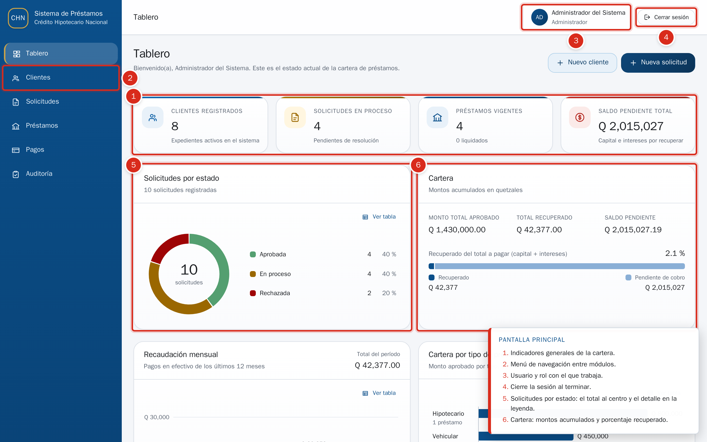
*Figura 2. Pantalla principal (Tablero).*

Los números de la Figura 2 señalan:

1. **Indicadores generales de la cartera.** Son las cuatro tarjetas de la parte superior.
2. **Menú de navegación entre módulos.** Es la columna azul de la izquierda.
3. **Usuario y rol con el que trabaja.** Aparece arriba a la derecha, con sus iniciales.
4. **Cierre la sesión al terminar** con el botón *Cerrar sesión*, a la derecha de su nombre.
5. **Solicitudes por estado.** La gráfica de anillo que reparte las solicitudes entre sus tres estados.
6. **Cartera.** Los montos acumulados y la barra con el porcentaje recuperado.

Mientras el sistema consulta las cifras verá el mensaje *Cargando indicadores...*. Si la consulta falla, aparece un recuadro rojo, *No se pudo cargar el resumen*, con el botón **Reintentar**; en ese caso el Tablero no muestra indicadores ni gráficas. Así, **un cero en el Tablero siempre es un dato real**, nunca el resultado de un error.

### Qué significa cada indicador

| Indicador | Qué le dice |
|---|---|
| **Clientes registrados** | Cuántos expedientes de clientes hay en el sistema. |
| **Solicitudes en proceso** | Cuántas solicitudes están pendientes de que un analista las apruebe o las rechace. |
| **Préstamos vigentes** | Cuántos préstamos aún tienen saldo por pagar. Debajo se indica cuántos ya están liquidados. |
| **Saldo pendiente total** | Suma de capital e intereses que falta recuperar de toda la cartera. |

Debajo de los indicadores encontrará cuatro paneles, en dos filas, y una tabla:

| Panel | Qué le muestra |
|---|---|
| **Solicitudes por estado** | Cómo se reparten las solicitudes entre Aprobada, En proceso y Rechazada. |
| **Cartera** | Cuánto se ha aprobado, cuánto se ha recuperado y cuánto falta por cobrar. |
| **Recaudación mensual** | Cuánto se cobró en cada uno de los últimos 12 meses. |
| **Cartera por tipo de préstamo** | Cuánto se ha aprobado en cada tipo de préstamo. |
| **Últimas solicitudes** | Las cinco solicitudes más recientes, con su número, cliente, monto, estado y fecha. El enlace *Ver todas* lo lleva al listado completo. |

Las dos primeras gráficas están en la Figura 2. Para ver la segunda fila, desplace la pantalla hacia abajo:

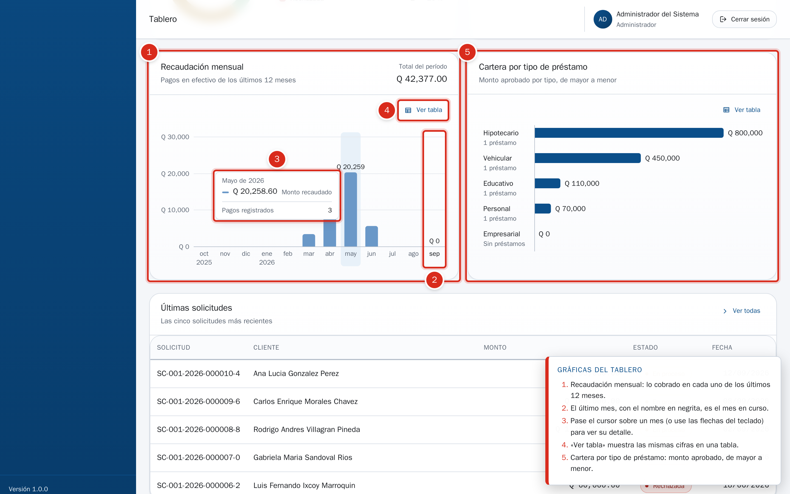
*Figura 3. Segunda fila de gráficas del Tablero.*

Los números de la Figura 3 señalan:

1. **Recaudación mensual.** Lo cobrado en cada uno de los últimos 12 meses.
2. **El mes en curso.** Es el último de la gráfica, con su nombre en negrita.
3. **El detalle de un mes.** Aparece al pasar el cursor sobre una columna o al recorrerlas con el teclado.
4. **Ver tabla.** Muestra las mismas cifras en forma de tabla.
5. **Cartera por tipo de préstamo.** El monto aprobado de cada tipo, de mayor a menor.

### Cómo leer las gráficas

#### Solicitudes por estado

Es un anillo dividido en tres partes: **Aprobada** (verde), **En proceso** (ámbar) y **Rechazada** (rojo). Cada parte ocupa del anillo la misma proporción que sus solicitudes ocupan del total: si hay 10 solicitudes y 4 están aprobadas, el tramo verde es el 40 % del anillo.

- **La cifra grande del centro es el total de solicitudes registradas**, sumando los tres estados. El mismo total aparece bajo el título del panel, por ejemplo *10 solicitudes registradas*.
- **La leyenda**, a la derecha del anillo (o debajo, en pantallas angostas), repite para cada estado su color, su nombre, la cantidad de solicitudes y el porcentaje sobre el total. Los tres porcentajes siempre suman 100 %.
- No necesita distinguir los colores para leerla: la leyenda escribe el nombre de cada estado junto a su cifra.

#### Cartera

Arriba verá tres montos de toda la cartera:

| Monto | Qué es |
|---|---|
| **Monto total aprobado** | El capital desembolsado en todos los préstamos. |
| **Total recuperado** | Todo lo que los clientes han pagado, capital e intereses. |
| **Saldo pendiente** | Lo que falta por cobrar, capital e intereses. |

Debajo, la barra **Recuperado del total a pagar (capital + intereses)** compara lo cobrado con lo que se cobrará en total. El tramo azul oscuro es lo *Recuperado* y el tramo claro lo *Pendiente de cobro*; en los extremos de la barra se lee el monto de cada tramo.

**Cómo se calcula el porcentaje.** Es el total recuperado dividido entre el total a pagar con intereses, es decir, entre la suma de lo recuperado y el saldo pendiente:

> Porcentaje recuperado = Total recuperado ÷ (Total recuperado + Saldo pendiente)

Por ejemplo, con Q 42,377.00 recuperados y Q 2,015,027.19 de saldo pendiente, el total a pagar es Q 2,057,404.19 y el porcentaje es **2.1 %**.

> **Por qué no se divide entre el monto aprobado.** Los pagos incluyen intereses, pero el monto aprobado es solo capital. Dividir lo cobrado entre el capital haría parecer más avanzada la recuperación de lo que realmente está: con las mismas cifras del ejemplo daría 3.0 %. Si recuerda haber visto un porcentaje mayor en versiones anteriores del sistema, esa es la razón del cambio.

#### Recaudación mensual

Cada columna es un mes de los últimos 12, del más antiguo, a la izquierda, al actual, a la derecha. La altura de la columna es la suma de los pagos en efectivo recibidos en ese mes.

- Bajo cada columna está el nombre abreviado del mes. El año se escribe bajo el primer mes y cada vez que cambia, por ejemplo al pasar de diciembre a enero. En pantallas angostas se escribe un mes de cada dos o tres, pero el mes en curso conserva siempre su nombre.
- **La columna resaltada, en azul más intenso y con el nombre del mes en negrita, es el mes en curso.** Como el mes no ha terminado, es normal que sea más baja que las demás, o que todavía no tenga columna.
- Solo dos columnas llevan la cifra escrita encima: la más alta y la del mes en curso. El resto de montos se lee en la escala de la izquierda, en el detalle de cada mes o con *Ver tabla*.
- Un mes sin pagos no tiene columna, pero conserva su lugar, de modo que siempre ve los 12 meses seguidos.
- Arriba a la derecha del panel, **Total del período** suma lo cobrado en los 12 meses.

#### Cartera por tipo de préstamo

Una barra por cada tipo de préstamo (Personal, Hipotecario, Vehicular, Empresarial y Educativo), ordenadas **de mayor a menor monto aprobado**. Todas llevan el mismo color: lo que las distingue es su largo.

- La cifra al final de cada barra es el monto aprobado de ese tipo, sin centavos.
- Bajo el nombre del tipo se indica cuántos préstamos tiene, o *Sin préstamos* si todavía no hay ninguno. Los cinco tipos aparecen siempre, aunque alguno esté en cero.
- El monto aprobado es el capital que se desembolsó, que puede ser menor que el solicitado si el analista aprobó un monto menor.
- El detalle de cada barra agrega el saldo pendiente y el total recuperado de ese tipo.

### Cómo consultar el detalle de una gráfica

Las tres gráficas responden igual:

- **Con el ratón.** Pase el cursor sobre un tramo del anillo, una columna o una barra. Aparece un recuadro con el nombre, la cifra completa (con centavos en los montos) y los datos adicionales: en el anillo, el porcentaje del total; en la recaudación, la cantidad de pagos registrados en ese mes; en la cartera por tipo, la cantidad de préstamos, el saldo pendiente y el total recuperado. En el anillo también puede pasar el cursor sobre la leyenda. El recuadro desaparece al retirar el cursor.
- **Con el teclado.** Pulse `Tab` hasta llegar a la gráfica: la marca seleccionada se rodea de un contorno azul y muestra su detalle. Use las **flechas** para pasar a la siguiente o a la anterior, `Inicio` y `Fin` para ir a la primera o a la última, y `Esc` para ocultar el recuadro. Con `Tab` sale de la gráfica.
- **En una pantalla táctil.** Toque la marca: el detalle queda a la vista hasta que toque fuera de la gráfica.
- **Ver tabla.** Arriba a la derecha de cada gráfica, el botón **Ver tabla** cambia el dibujo por una tabla con las mismas cifras, completas (los montos, con centavos). En *Solicitudes por estado* muestra la cantidad y el porcentaje de cada estado, con una fila de *Total* (100 %). En *Recaudación mensual* muestra el monto y la cantidad de pagos de cada mes, con la fila del mes en curso resaltada. En *Cartera por tipo de préstamo* muestra el monto aprobado, los préstamos, el saldo pendiente y el total recuperado de cada tipo. El mismo botón, que ahora dice **Ver gráfica**, regresa al dibujo.

> **Consejo.** Use *Ver tabla* cuando necesite copiar una cifra exacta o prefiera no depender de los colores.

Si una gráfica no tiene nada que mostrar, en su lugar aparece un mensaje que lo explica: *Sin solicitudes*, *Sin pagos en el período* o *Sin préstamos aprobados*.

### El menú lateral

| Opción | Para qué sirve |
|---|---|
| **Tablero** | Volver a esta pantalla de resumen. |
| **Clientes** | Consultar, registrar, editar o eliminar expedientes de clientes. |
| **Solicitudes** | Registrar solicitudes de préstamo y resolverlas. |
| **Préstamos** | Consultar los préstamos aprobados, su saldo y su plan de cuotas. |
| **Pagos** | Registrar pagos en efectivo y consultar el historial con sus comprobantes. |
| **Auditoría** | Consultar la bitácora del sistema. Solo aparece para el perfil Administrador. |

En la parte superior derecha, cuando su perfil lo permite, verá además los accesos rápidos **Nuevo cliente** y **Nueva solicitud**.

### Cómo cerrar sesión

Pulse el botón **Cerrar sesión**, arriba a la derecha (número 4 de la Figura 2). El sistema lo devuelve a la pantalla de ingreso y muestra el aviso *«Sesión cerrada correctamente»*. Cierre siempre su sesión antes de dejar la computadora.

---

## 3. Filtrar y buscar en los listados

Las cinco pantallas de listado del sistema —**Clientes**, **Solicitudes**, **Préstamos**, **Pagos** y **Auditoría**— se consultan de la misma manera: todas tienen, encima de la tabla, el mismo **panel de filtros**. Lo que aprenda aquí le sirve en las cinco.

### 3.1 El panel de filtros, paso a paso

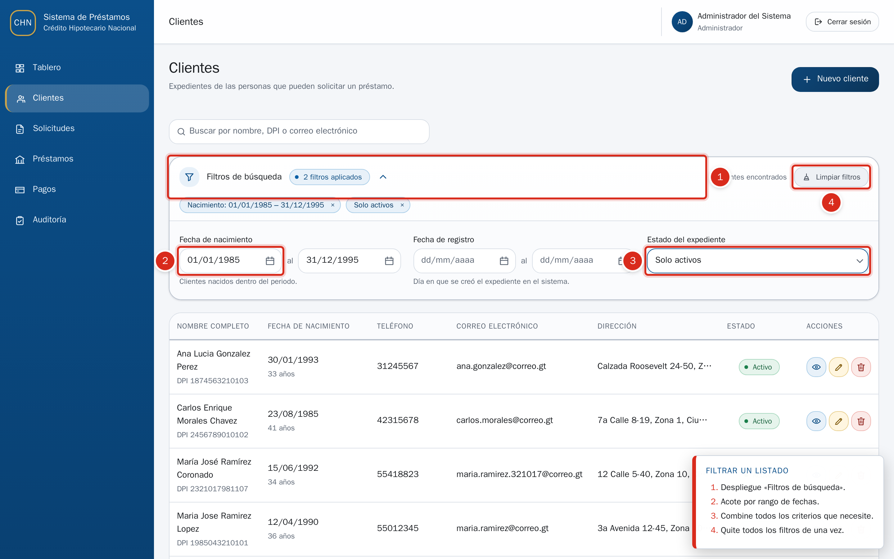
*Figura 4. El panel de filtros de un listado, con dos criterios aplicados.*

Los números de la Figura 4 señalan:

1. **Despliegue «Filtros de búsqueda»**, la barra que está sobre la tabla. Al pulsarla se abre y deja a la vista los campos; al volver a pulsarla se cierra y la tabla gana espacio.
2. **Acote por rango de fechas**, escribiendo el día inicial y el día final del periodo que le interesa.
3. **Combine todos los criterios que necesite**: los desplegables, los rangos de importe y el texto libre pueden usarse a la vez.
4. **Quite todos los filtros de una vez** con el botón *Limpiar filtros*.

Lo que conviene saber para usarlo con soltura:

- **Dónde está.** Siempre en el mismo sitio: entre el título de la pantalla y la tabla. Normalmente aparece cerrado, para no estorbar; se abre solo si usted llega a la pantalla con filtros ya puestos.
- **El contador.** Junto al título aparece una etiqueta azul con el número de criterios puestos: *«1 filtro aplicado»*, *«2 filtros aplicados»*… Si no hay ninguno, la etiqueta no aparece. Así sabe de un vistazo si lo que ve en la tabla es todo el listado o solo una parte.
- **Las pastillas.** Cada criterio aplicado se muestra debajo como una pastilla con su nombre y su valor, por ejemplo *«Nacimiento: 01/01/1985 al 31/12/1995»*. Cada pastilla lleva una **X**: púlsela para quitar **ese** criterio sin tocar los demás. Las pastillas siguen visibles aunque cierre el panel, de modo que nunca filtra sin darse cuenta.
- **Los criterios se suman.** Cuando pone varios, el listado muestra solo los registros que cumplen **todos a la vez**. Si filtra clientes activos *y* nacidos entre 1985 y 1995, verá únicamente los que cumplen las dos condiciones. Por eso, cuantos más criterios ponga, menos registros verá.
- **Un periodo cuenta como un solo filtro.** Aunque escriba dos fechas, «del … al …» es un único criterio y ocupa una única pastilla.
- **No hay que pulsar ningún botón.** El listado se actualiza solo. Los desplegables y las fechas se aplican al instante; en los campos donde usted escribe, el sistema espera un momento a que termine de teclear y entonces busca. Cada vez que cambia un criterio, el listado vuelve a la **primera página**.
- **Las listas desplegables.** Los criterios que se eligen de una lista —*Estado*, *Cliente*, *Tipo de préstamo*…— se abren pulsándolos, marcan con un visto la opción que tiene puesta y, cuando la lista es larga, traen un cuadro para escribir y reducirla. Están explicadas en [3.4](#34-elegir-en-una-lista-desplegable).
- **Limpiar de una vez.** El botón *Limpiar filtros* aparece en cuanto hay al menos un criterio puesto y los retira todos, dejando el listado completo.
- **Cuando no hay coincidencias.** El sistema distingue dos situaciones. Si el listado está vacío porque aún no hay registros, se lo dice así. Si está vacío porque sus filtros no encontraron nada, muestra *«Sin resultados»* y le ofrece un botón para limpiar los filtros y volver a ver todo.
- **El total encontrado.** A la derecha de la barra, el panel indica siempre cuántos registros cumplen lo que ha pedido: *«8 clientes encontrados»*, *«1 solicitud encontrada»*…
- **Acentos y mayúsculas dan igual.** En cualquier campo de texto puede escribir sin tildes y en minúsculas: buscar `ramirez` encuentra a «Ramírez», y buscar `MARIA` encuentra a «María».

> **Consejo.** Si un listado le muestra menos registros de los que espera, mire primero el contador y las pastillas: casi siempre hay un filtro puesto de una consulta anterior. Quítelo con su X, o use *Limpiar filtros*.

### 3.2 Qué puede filtrar en cada pantalla

Cada pantalla ofrece los criterios que tienen sentido en su trabajo. Todos son opcionales: deje vacío lo que no quiera acotar.

#### Clientes

| Criterio | Para qué le sirve |
|---|---|
| **Búsqueda** (barra superior) | Encontrar a una persona por nombre, apellido, nombre completo, DPI, correo electrónico o teléfono. |
| **Fecha de nacimiento** (del … al …) | Ver a los clientes nacidos dentro de un periodo, por ejemplo para revisar un segmento de edad. |
| **Fecha de registro** (del … al …) | Ver los expedientes creados en un periodo: lo captado esta semana o este mes. |
| **Estado del expediente** | Mostrar *Solo activos* o *Solo inactivos*. La primera opción de la lista, *Todos*, quita el criterio y vuelve a mostrarlos todos. |

#### Solicitudes

| Criterio | Para qué le sirve |
|---|---|
| **Búsqueda** | Localizar una solicitud por su número, por su destino o por el nombre o el DPI del cliente. |
| **Estado** | Ver solo las que están *En proceso* (la cola de trabajo del analista), o solo las *Aprobadas* o las *Rechazadas*. |
| **Cliente** | Reunir todas las peticiones de una misma persona antes de resolver. |
| **Tipo de préstamo** | Separar lo hipotecario de lo personal, vehicular, empresarial o educativo. |
| **Monto solicitado** (desde / hasta) | Aislar las operaciones grandes, que suelen requerir otro nivel de autorización. |
| **Plazo** (desde / hasta) | Revisar las peticiones a plazos largos, que comprometen la cartera más tiempo. |
| **Fecha de solicitud** (del … al …) | Medir lo recibido en un día, una semana o un mes. |

> **Atajo útil.** Encima de la tabla, el panel *Solicitudes por estado* muestra los tres conteos (En proceso, Aprobadas, Rechazadas) y **se puede pulsar**: al pulsar un conteo, el listado queda filtrado por ese estado; al volver a pulsarlo, el filtro se quita.

#### Préstamos

| Criterio | Para qué le sirve |
|---|---|
| **Búsqueda** | Localizar un préstamo por su número, por el número de la solicitud que lo originó o por el nombre o el DPI del cliente. |
| **Estado** | Separar los *Vigentes* (aún deben) de los *Liquidados* (ya pagados). |
| **Cliente** | Ver de una sola vez todos los préstamos de una misma persona. |
| **Monto aprobado** (desde / hasta) | Revisar la cartera por tamaño de operación. |
| **Saldo pendiente** (desde / hasta) | **Preparar la gestión de cobro:** escriba un saldo mínimo (por ejemplo, desde Q 50,000.00) y obtendrá la lista de los préstamos con mayor deuda por recuperar, que son los que conviene atender primero. |
| **Fecha de desembolso** (del … al …) | Ver lo colocado en un periodo. |
| **Fecha de vencimiento** (del … al …) | Anticipar los préstamos que terminan en los próximos meses. |

#### Pagos

| Criterio | Para qué le sirve |
|---|---|
| **Búsqueda** | Encontrar un recibo por su número, por el número de préstamo o por el nombre o el DPI del cliente. |
| **Cliente** | Reconstruir todo lo que ha pagado una persona. |
| **Préstamo** | Ver los abonos aplicados a un préstamo concreto. |
| **Monto desde (Q) / Monto hasta (Q)** | Localizar cobros de cierta cuantía, por ejemplo al revisar un movimiento dudoso. |
| **Fecha de pago** (del … al …) | **Cuadrar la caja de un día:** ponga la misma fecha en los dos extremos y el listado mostrará exactamente los recibos de esa jornada. |
| **Registrado por** | Ver lo cobrado por una ventanilla concreta, escribiendo el usuario del cajero. |

#### Auditoría

| Criterio | Para qué le sirve |
|---|---|
| **Búsqueda** | Buscar por usuario, por el detalle del registro o por el identificador del registro afectado. |
| **Usuario** | Seguir lo que hizo una persona concreta. |
| **Acción** | Aislar un tipo de operación: clientes eliminados, solicitudes aprobadas, pagos registrados, accesos al sistema… |
| **Entidad** | Ver solo lo ocurrido sobre clientes, solicitudes, préstamos, pagos o usuarios. |
| **Fecha del registro** (del … al …) | Acotar la revisión al día o al periodo que se está aclarando. |

> **Nota.** Los periodos incluyen sus dos días extremos. Si consulta del 01/09/2026 al 30/09/2026, entran también los movimientos del día 1 y los del día 30, aunque estos últimos se hayan registrado a última hora de la tarde.

### 3.3 La búsqueda rápida de clientes

La pantalla de **Clientes** tiene además una **barra de búsqueda** propia, encima del panel de filtros. Sirve para lo más frecuente: encontrar a una persona por nombre, DPI, correo o teléfono sin abrir nada.

- Escriba en ella y la lista se va ajustando sola; no hace falta pulsar ningún botón.
- La cruz del extremo derecho borra lo escrito y devuelve el listado completo.
- Lo que escriba aquí **también aparece como pastilla** en el panel de filtros, y se combina con los demás criterios que tenga puestos.

En resumen: la barra superior es el atajo del día a día; el panel es para afinar la consulta con fechas, estado y, en las demás pantallas, montos, saldos y plazos.

### 3.4 Elegir en una lista desplegable

Algunos criterios no se escriben: se eligen de una lista —*Estado*, *Tipo de préstamo*, *Cliente*, *Acción*, *Entidad*…—. Todas las listas del sistema funcionan igual, tanto en los filtros como en los formularios (el cliente de una solicitud nueva, el préstamo de un pago o los *Registros por página* del pie de las tablas).

- **Pulse el campo para abrir la lista.** Se despliega justo debajo —o encima, si no hay sitio— con las opciones disponibles. Para cerrarla sin cambiar nada, pulse fuera de ella o la tecla `Esc`.
- **La opción elegida queda marcada con un visto** a la derecha de su nombre, y ese nombre se sigue leyendo en el campo aunque la lista esté cerrada. Así siempre sabe qué tiene puesto.
- **Si la lista es larga, arriba aparece un cuadro para escribir.** Escriba parte de lo que busca y la lista se queda solo con lo que coincide. No hace falta poner tildes ni mayúsculas: `ramirez` encuentra a «Ramírez» y `MARIA` encuentra a «María». Si no queda ninguna coincidencia, la propia lista se lo indica.
- **La primera fila es la que deja de filtrar.** En los filtros, opciones como *Todos los clientes* o *Todos los estados* significan «sin acotar por este criterio»: elíjala para quitar ese filtro.
- **También se puede usar sin ratón.** Con el campo señalado, `Intro`, la barra espaciadora o las flechas `↑` y `↓` abren la lista. Dentro de ella, `↑` y `↓` recorren las opciones —la que está resaltada es la que se va a elegir—, `Inicio` y `Fin` llevan a la primera y a la última, `Intro` confirma y `Esc` cierra sin cambiar nada. `Tab` cierra la lista y pasa al campo siguiente.
- **Escribir una letra es un atajo.** Si la lista no tiene cuadro de búsqueda, al pulsar una letra salta a la primera opción que empieza por ella; y con la lista cerrada, la abre ya situada ahí.
- **Si el campo aparece apagado**, el sistema todavía está trayendo su lista —por ejemplo, el catálogo de clientes—: espere un momento y vuelva a pulsarlo.

---

## 4. Elegir una fecha

Todos los campos de fecha del sistema —la fecha de nacimiento de un cliente, los periodos de los filtros— funcionan igual y usan siempre el mismo formato: **dd/mm/aaaa**.

### 4.1 Escribir la fecha o usar el calendario

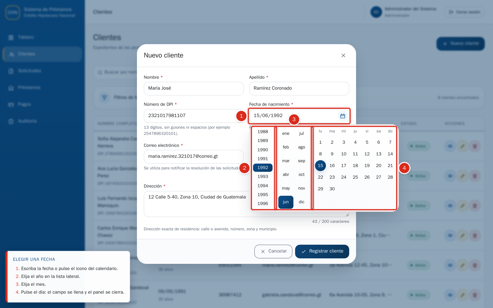
*Figura 5. El calendario de tres columnas, abierto sobre el formulario de un cliente.*

Los números de la Figura 5 señalan:

1. **Escriba la fecha o pulse el icono del calendario.** Puede teclearla directamente, solo con números: el campo va colocando las barras por usted, de modo que al escribir `15061992` queda `15/06/1992`. Si prefiere el calendario, pulse el icono que está a la derecha del campo.
2. **Elija el año en la lista lateral.** La primera columna es una lista de años que se desplaza hacia arriba y hacia abajo; el año en el que está situado aparece resaltado.
3. **Elija el mes.** La columna central muestra los doce meses abreviados a tres letras (ene, feb, mar…), repartidos en dos columnas de seis. El mes en el que está situado aparece resaltado.
4. **Pulse el día: el campo se llena y el panel se cierra.** La tercera columna es el mes elegido, con la semana empezando en **lunes** (lu, ma, mi, ju, vi, sa, do). El día elegido se marca con un círculo.

Detalles prácticos:

- Elegir un **año** o un **mes** solo mueve el calendario; el panel **no se cierra**. Se cierra únicamente al pulsar un **día**.
- El panel se dibuja encima de todo lo demás, así que se ve completo aunque el campo esté dentro de una ventana.
- **Sin ratón también se puede.** Con el campo señalado, la tecla `Intro` o la flecha `↓` abren el calendario. Dentro de él, las flechas `←` y `→` mueven un día, `↑` y `↓` una semana, `Re Pág` y `Av Pág` cambian de mes, `Inicio` y `Fin` llevan al primer y al último día del mes, `Intro` confirma el día y `Esc` cierra sin elegir nada.
- **El sistema no deja elegir una fecha no permitida.** Los días que no se admiten aparecen apagados y no responden al pulsarlos. Por ejemplo, al registrar un cliente el calendario no ofrece ninguna fecha que corresponda a un menor de 18 años, ni fechas futuras. Si escribe una de esas fechas a mano, el campo se marca en rojo y el registro no se guarda.
- Si escribe una fecha que no existe, como 31/02/2026, el campo la rechaza y se lo indica.

### 4.2 Indicar un periodo «del … al …»

En los filtros, las fechas van por parejas: **[dd/mm/aaaa] al [dd/mm/aaaa]**. La primera casilla es el día inicial y la segunda el día final; entre las dos aparece la palabra *al*.

- Cada casilla tiene su propio calendario y funciona como se explicó arriba.
- **No puede invertir el periodo.** Una vez fijado el día inicial, el calendario de la segunda casilla no ofrece días anteriores a él.
- Puede rellenar **una sola casilla**: solo la primera significa «desde esa fecha en adelante»; solo la segunda, «hasta esa fecha».
- Poner la **misma fecha** en las dos casillas es la forma de consultar **un único día**.
- El periodo incluye siempre sus dos días extremos.

---

## 5. El color de los botones

En este sistema el color de un botón **anticipa lo que va a pasar al pulsarlo**, y el criterio es el mismo en todas las pantallas. Puede apoyarse en el color para no equivocarse.

| Color | Qué significa | Botones que lo llevan |
|---|---|---|
| **Azul institucional** | La acción principal: el botón que continúa o guarda. | *Registrar cliente*, *Guardar cambios*, *Nuevo cliente*, *Nueva solicitud*, *Buscar*, *Ingresar*. |
| **Verde** | Resuelve a favor del cliente: se aprueba un crédito o entra dinero. | *Aprobar*, *Confirmar aprobación*, *Registrar pago*. |
| **Rojo** | Elimina o niega. **No se puede deshacer.** | *Eliminar*, *Sí, eliminar*, *Rechazar*, *Confirmar rechazo*. |
| **Ámbar** | Modifica algo que ya existe. | *Editar*, el lápiz que hay al final de cada fila. |
| **Azul claro** | Consulta: muestra información sin cambiar nada. | *Ver*, la lupa de cada fila; *Simular*; *Ver comprobante*. |
| **Gris con el borde marcado** | No tiene consecuencia: se puede pulsar sin miedo. | *Cancelar*, *Cerrar*, *Imprimir*, *Limpiar filtros*. |

El **verde está reservado** a los dos momentos en que el sistema cierra algo a favor del cliente: aprobar una solicitud y recibir un pago. Guardar un formulario corriente va en azul, no en verde. Así, cuando vea verde, sabrá que está a punto de resolver un crédito o de registrar dinero, no de guardar unos datos.

Los botones sin consecuencia se dibujan **solo con el borde**, sin relleno: se distinguen a simple vista del botón principal, que sí va relleno. En cualquier ventana, el botón relleno de la derecha es el que completa la operación y el del borde es el que la abandona.

Los iconos que hay al final de cada fila de una tabla siguen el mismo código, en tono suave: la **lupa** es azul, el **lápiz** es ámbar y la **papelera** es roja.

> **⚠ Antes de pulsar un botón rojo, deténgase.** El rojo está reservado a lo que destruye información o niega una petición, y ninguna de esas operaciones se puede revertir desde el sistema. Compruebe siempre el nombre y el número del registro que muestra la ventana de confirmación.

Al pasar el puntero, los botones se elevan un poco y toman una sombra de su propio color; al pulsarlos se hunden un instante. Es la confirmación visual de que el sistema recibió la orden.

> **Nota.** Si en su computadora está activada la opción de **reducir el movimiento**, el sistema la respeta y muestra la misma interfaz sin animaciones. No deja de funcionar nada.

---

## 6. Gestionar clientes

El cliente es la base de todo: sin expediente de cliente no se puede registrar una solicitud de préstamo.

### 6.1 Consultar y buscar clientes

En el menú lateral pulse **Clientes**.

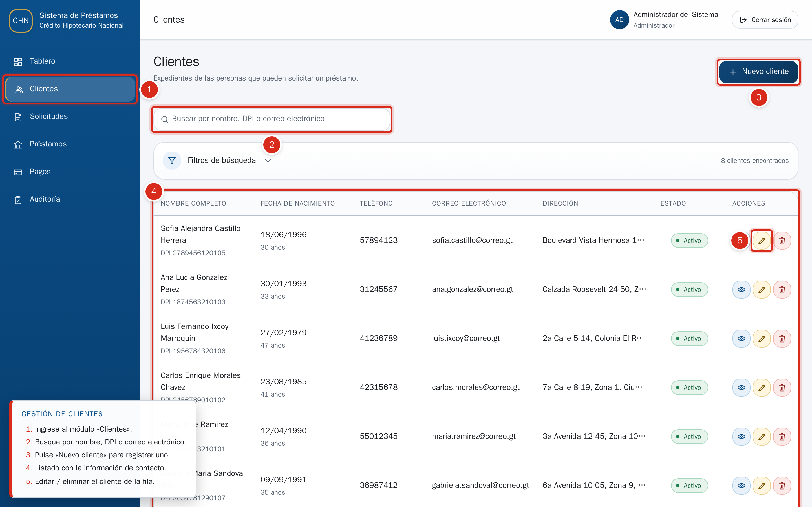
*Figura 6. Listado de clientes.*

Los números de la Figura 6 señalan:

1. **Ingrese al módulo «Clientes»** desde el menú lateral.
2. **Busque por nombre, DPI o correo electrónico** escribiendo en la barra de búsqueda. La lista se filtra sola mientras escribe; no hace falta pulsar ningún botón. La cruz del extremo derecho limpia la búsqueda. También encuentra por apellido y por teléfono, y no necesita escribir tildes.
3. **Pulse «Nuevo cliente»** para registrar uno (solo Administrador y Analista de crédito).
4. **Listado con la información de contacto.** La tabla muestra las columnas *Nombre completo* (con el DPI debajo), *Fecha de nacimiento* (con la edad), *Teléfono*, *Correo electrónico* y *Dirección*.
5. **Editar / eliminar el cliente de la fila.** Al final de cada fila hay iconos de acción: **ver** (lupa), **editar** (lápiz) y **eliminar** (papelera). Solo aparecen los que su perfil permite.

Debajo de la búsqueda está el **panel de filtros**, con el que puede acotar el padrón por fecha de nacimiento, por fecha de registro y por estado del expediente. Su funcionamiento se explica en la [sección 3](#3-filtrar-y-buscar-en-los-listados). A la derecha de la barra del panel, el sistema indica cuántos clientes encontró, por ejemplo *«8 clientes encontrados»*.

Al pie de la tabla, el paginador muestra el texto *«Mostrando 1–10 de 8 registros»*, las flechas para cambiar de página y un selector de *Registros por página*.

Si la búsqueda no encuentra nada, el sistema muestra el aviso **Sin resultados**, le explica que ningún cliente coincide con lo que pidió y le ofrece el botón *Limpiar filtros* para volver a ver todo el padrón.

### 6.2 Registrar un cliente nuevo

Desde el listado de clientes pulse **Nuevo cliente**. Se abre la ventana *Nuevo cliente*.

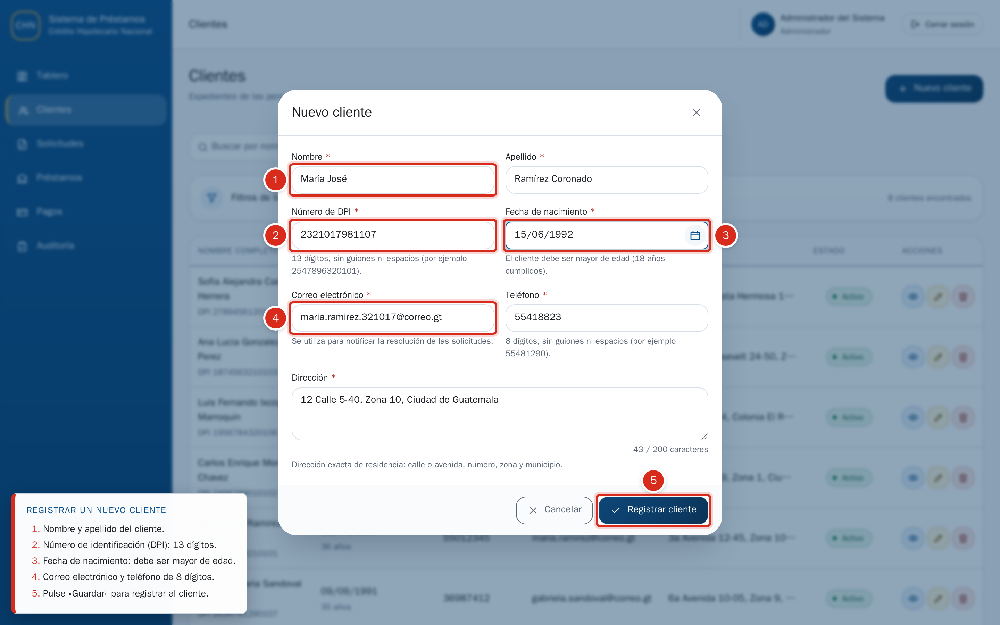
*Figura 7. Formulario de registro de un cliente nuevo.*

Los números de la Figura 7 señalan:

1. **Nombre y apellido del cliente**, en los dos primeros campos.
2. **Número de identificación (DPI): 13 dígitos**, sin guiones ni espacios.
3. **Fecha de nacimiento: debe ser mayor de edad.** Escríbala en formato dd/mm/aaaa o elíjala en el calendario del campo, como se explica en la [sección 4](#4-elegir-una-fecha).
4. **Correo electrónico y teléfono de 8 dígitos.**
5. **Pulse «Registrar cliente»**, el botón de guardar que está al pie de la ventana, para registrar al cliente.

Al terminar, el sistema muestra el aviso *«Cliente registrado»* y el cliente aparece de inmediato en el listado.

#### Campos del formulario y su formato obligatorio

| Campo | ¿Obligatorio? | Formato que exige el sistema |
|---|---|---|
| **Nombre** | Sí | De 2 a 60 caracteres. |
| **Apellido** | Sí | De 2 a 60 caracteres. |
| **Número de DPI** | Sí | Exactamente **13 dígitos**, sin guiones ni espacios (por ejemplo 2547896320101). No puede repetirse: cada cliente tiene un DPI único. |
| **Fecha de nacimiento** | Sí | En formato **dd/mm/aaaa**. El cliente debe ser **mayor de edad** (18 años cumplidos): el calendario muestra apagados, y no deja pulsar, los días más recientes. |
| **Correo electrónico** | Sí | Una dirección válida, como `nombre.apellido@correo.com`, de hasta 120 caracteres. No puede repetirse entre clientes. El sistema lo guarda en minúsculas. |
| **Teléfono** | Sí | Exactamente **8 dígitos**, sin guiones ni espacios (por ejemplo 55481290). |
| **Dirección** | Sí | De 5 a 200 caracteres. Escriba la dirección exacta de residencia: calle o avenida, número, zona y municipio. |

> **Nota.** Los campos de DPI y de teléfono solo aceptan números: si escribe letras o guiones, el sistema los descarta automáticamente. Si algún dato no cumple el formato, aparecerá un mensaje en rojo bajo el campo y el cliente no se guardará hasta que lo corrija.

### 6.3 Editar un cliente

1. En el listado de clientes, localice la fila del cliente (puede ayudarse de la búsqueda).
2. Pulse el icono del **lápiz** al final de la fila.
3. Se abre la ventana *Editar a &lt;nombre del cliente&gt;*. Modifique los datos y pulse **Guardar cambios**.

Solo se pueden modificar los **datos de contacto**: nombre, apellido, correo electrónico, teléfono y dirección.

> **¿Por qué no se pueden cambiar el DPI ni la fecha de nacimiento?**
> Porque son los datos que identifican legalmente a la persona y sobre los que se apoyan todas sus solicitudes, préstamos y pagos. Cambiarlos equivaldría a cambiar de persona sin dejar rastro. En la pantalla aparecen en gris, con el aviso *«El DPI no se puede modificar después del registro»*. Si un DPI o una fecha de nacimiento se capturó mal, comuníquese con el administrador del sistema: lo correcto es dar de baja el expediente equivocado y registrar el correcto.

### 6.4 Consultar la ficha completa

Pulse el icono de **ver** (la lupa) en la fila del cliente.

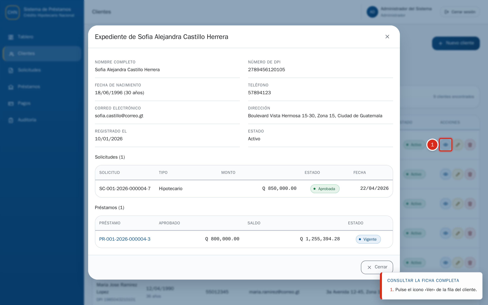
*Figura 8. Ficha completa del cliente.*

El número de la Figura 8 señala:

1. **Pulse el icono «Ver» de la fila del cliente** para abrir su expediente.

La ficha se abre en una ventana titulada *Expediente de &lt;nombre del cliente&gt;* y contiene:

- **Datos personales:** nombre completo, número de DPI, fecha de nacimiento con la edad, teléfono, correo electrónico, dirección, fecha de registro y estado (Activo o Inactivo).
- **Solicitudes.** Todas las solicitudes del cliente con su número, tipo, monto, estado y fecha.
- **Préstamos.** Todos sus préstamos con el número, el monto aprobado, el saldo y el estado. El número de préstamo es un enlace: al pulsarlo se abre el detalle de ese préstamo.

Para salir, pulse **Cerrar** o la tecla `Esc`.

### 6.5 Eliminar un cliente

Solo el perfil **Administrador** puede eliminar clientes. En la fila del cliente, pulse el icono de la **papelera**. El sistema pide confirmación.

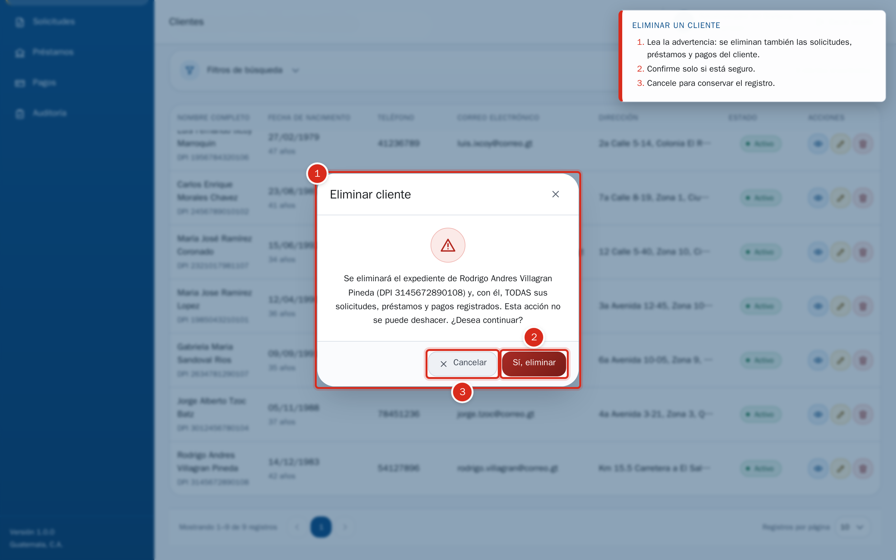
*Figura 9. Confirmación para eliminar un cliente.*

Los números de la Figura 9 señalan:

1. **Lea la advertencia:** se eliminan también las solicitudes, préstamos y pagos del cliente.
2. **Confirme solo si está seguro**, con el botón *Sí, eliminar*.
3. **Cancele para conservar el registro**, con el botón *Cancelar*.

> **⚠ ADVERTENCIA. Esta acción no se puede deshacer.**
> Al eliminar un cliente, el sistema borra **todo su historial**: sus solicitudes de préstamo, sus préstamos y todos los pagos registrados sobre ellos. No existe un botón para recuperar la información, ni desde el sistema ni desde esta pantalla.
> Antes de continuar, asegúrese de que se trata del cliente correcto (compruebe el nombre y el DPI que muestra el mensaje) y de que la baja está autorizada. Si solo quiere dejar de operar con el cliente, **no lo elimine**: consulte con el administrador.

Cuando el borrado se completa, el sistema muestra el aviso *«Cliente eliminado»*.

---

## 7. Solicitudes de préstamo

Una solicitud es la petición formal de un cliente: cuánto pide, a qué plazo y para qué. Nace **En proceso** y termina **Aprobada** o **Rechazada**.

### 7.1 Consultar el estado de las solicitudes

En el menú lateral pulse **Solicitudes**.

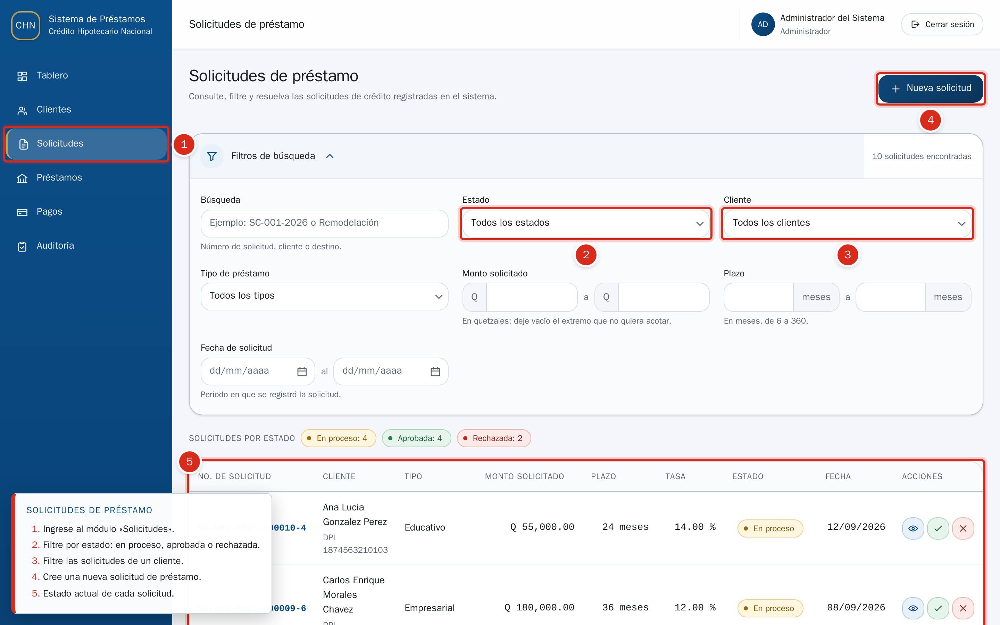
*Figura 10. Listado de solicitudes de préstamo.*

Los números de la Figura 10 señalan:

1. **Ingrese al módulo «Solicitudes»** desde el menú lateral.
2. **Filtre por estado:** en proceso, aprobada o rechazada, con el desplegable *Estado* del panel de filtros.
3. **Filtre las solicitudes de un cliente** con el desplegable *Cliente*, en el mismo panel.
4. **Cree una nueva solicitud de préstamo** con el botón *Nueva solicitud*.
5. **Estado actual de cada solicitud**, en la columna *Estado* de la tabla.

El panel de filtros ofrece además el texto libre, el tipo de préstamo y los rangos de monto, de plazo y de fecha de solicitud; todos se explican en la [sección 3](#3-filtrar-y-buscar-en-los-listados).

La tabla muestra las columnas *No. de solicitud*, *Cliente* (con su DPI), *Tipo*, *Monto solicitado*, *Plazo*, *Tasa*, *Estado* y *Fecha*. Sobre la tabla, el panel *Solicitudes por estado* resume cuántas hay de cada tipo; **pulse uno de esos conteos** y el listado se queda solo con ese estado, y púlselo otra vez para quitar el filtro. Al final de cada fila están los botones **Ver** y, si la solicitud está en proceso y su perfil lo permite, **Aprobar** y **Rechazar**.

#### Significado de cada estado

| Estado | Qué significa | Qué se puede hacer |
|---|---|---|
| **En proceso** | La solicitud fue registrada y espera la decisión del analista. | Consultarla, aprobarla o rechazarla. |
| **Aprobada** | El analista la autorizó. Al aprobarla, el sistema creó automáticamente el préstamo con su plan de cuotas. | Solo consultarla y ver el préstamo generado. Ya no admite cambios. |
| **Rechazada** | El analista la denegó y dejó registrado el motivo. | Solo consultarla. Si el cliente insiste, debe registrarse una solicitud nueva. |

### 7.2 Registrar una solicitud nueva

Pulse **Nueva solicitud** (o el acceso rápido del Tablero). Se abre la pantalla *Nueva solicitud de préstamo*, con el formulario a la izquierda y el panel de simulación a la derecha.

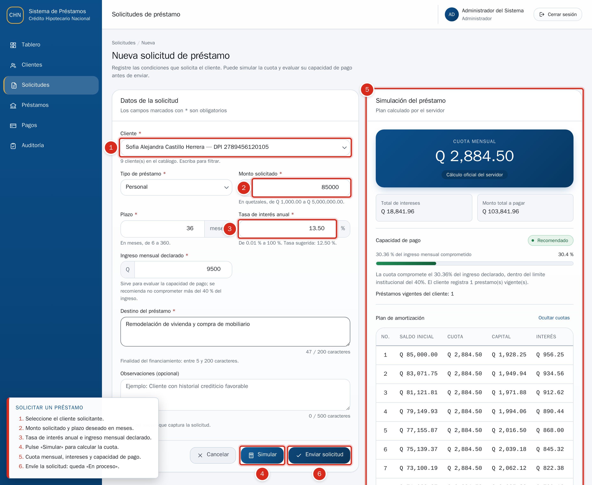
*Figura 11. Registro de una solicitud nueva con su simulación.*

Los números de la Figura 11 señalan:

1. **Seleccione el cliente solicitante** en el campo *Cliente*. Si la lista es larga, escriba parte del nombre o del DPI en el campo *Buscar cliente* que está justo arriba, o en el cuadro de búsqueda que aparece dentro de la propia lista al abrirla ([3.4](#34-elegir-en-una-lista-desplegable)).
2. **Monto solicitado y plazo deseado en meses.**
3. **Tasa de interés anual e ingreso mensual declarado.**
4. **Pulse «Simular» para calcular la cuota.**
5. **Cuota mensual, intereses y capacidad de pago**, en el panel de la derecha.
6. **Envíe la solicitud** con el botón *Enviar solicitud*: la solicitud queda **En proceso**.

Al enviarla, el sistema le asigna su número oficial (por ejemplo `SC-001-2026-000011-2`), muestra el aviso *«Solicitud registrada»* y abre su detalle.

#### Campos de la solicitud y rangos permitidos

| Campo | ¿Obligatorio? | Rango o formato permitido |
|---|---|---|
| **Cliente** | Sí | Debe elegirse de la lista; al abrirla puede escribir parte del nombre o del DPI para encontrarlo. Si el cliente no aparece, regístrelo primero en *Clientes*. |
| **Tipo de préstamo** | Sí | Personal, Hipotecario, Vehicular, Empresarial o Educativo. |
| **Monto solicitado** | Sí | De **Q 1,000.00** a **Q 5,000,000.00**, con un máximo de dos decimales. |
| **Plazo** | Sí | De **6** a **360** meses, en números enteros. |
| **Tasa de interés anual** | Sí | De **0.01 %** a **100 %**. La tasa sugerida por la institución es **12.50 %**; el analista puede modificarla. |
| **Ingreso mensual declarado** | Sí | Mayor que cero. Sirve para evaluar la capacidad de pago del cliente. |
| **Destino del préstamo** | Sí | De 5 a 200 caracteres. Por ejemplo: «Remodelación de vivienda familiar». |
| **Observaciones** | No | Hasta 500 caracteres. Notas del asesor que captura la solicitud. |

El botón **Cancelar** descarta lo capturado y regresa al listado.

### 7.3 Simular antes de enviar

Mientras escribe el monto, el plazo y la tasa, el panel de la derecha muestra una **cuota estimada** calculada en su propia computadora, con la nota *«Estimación local: pulse «Simular» para el cálculo del servidor»*. Es una referencia rápida.

Al pulsar **Simular** (número 4 de la Figura 11), el sistema hace el cálculo oficial y el panel muestra:

| Dato del panel | Qué significa, en palabras sencillas |
|---|---|
| **Cuota mensual** | Lo que el cliente pagaría cada mes, siempre la misma cantidad, hasta terminar de pagar el préstamo. |
| **Total de intereses** | Lo que el cliente pagará al banco por el servicio de prestarle el dinero, sumando todos los meses. Es dinero adicional al que recibe. |
| **Monto total a pagar** | La suma de todo: el dinero prestado más los intereses. Es lo que el cliente habrá entregado al final del plazo. |
| **Porcentaje del ingreso comprometido** | Qué parte de su sueldo mensual se le iría en la cuota. Por ejemplo, 30 % significa que de cada Q 100.00 que gana, Q 30.00 serían para pagar el préstamo. |
| **Préstamos vigentes del cliente** | Cuántos préstamos sin terminar de pagar tiene ya ese cliente. |

Junto al título *Capacidad de pago* aparece una etiqueta verde **Recomendado** o roja **No recomendado**. El sistema recomienda el préstamo cuando la cuota compromete **como máximo el 40 % del ingreso declarado** y el cliente tiene **menos de tres préstamos vigentes**.

> **Nota.** La recomendación es **orientativa**: es una ayuda para el analista, no una decisión del sistema. La decisión de aprobar o rechazar es siempre de la persona responsable, según las políticas de crédito de la institución. El sistema no impide aprobar una solicitud marcada como «No recomendado», ni obliga a aprobar una marcada como «Recomendado».

Si desea ver el detalle mes por mes, pulse **Ver primeras cuotas** y, después, **Ver plan completo**: se abre la tabla con todas las cuotas.

> Si cambia el cliente, el monto, el plazo, la tasa o el ingreso después de simular, la simulación se borra: vuelva a pulsar **Simular** para actualizar las cifras.

### 7.4 Aprobar una solicitud

Abra la solicitud desde el listado con el botón **Ver**. Si está *En proceso* y su perfil lo permite, verá los botones de resolución.

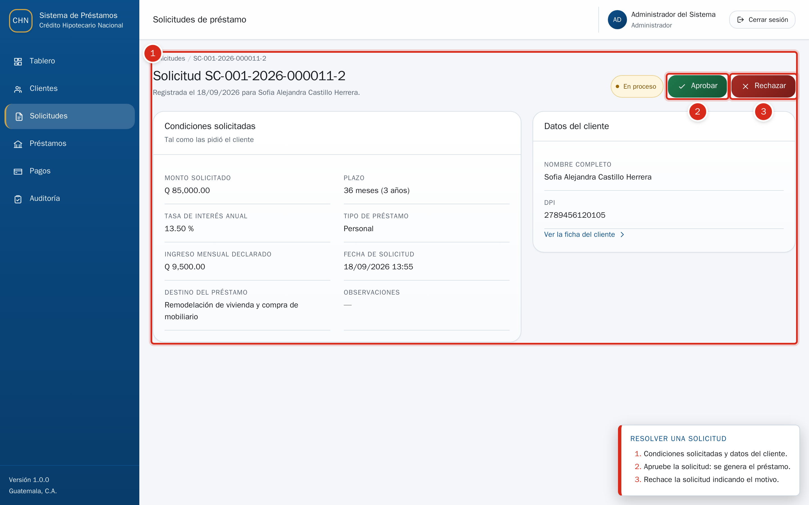
*Figura 12. Detalle de una solicitud en proceso.*

Los números de la Figura 12 señalan:

1. **Condiciones solicitadas y datos del cliente**, en las tarjetas del cuerpo de la pantalla.
2. **Apruebe la solicitud** con el botón verde *Aprobar*: se genera el préstamo.
3. **Rechace la solicitud** con el botón rojo *Rechazar*, indicando el motivo.

Al pulsar **Aprobar** se abre la ventana *Aprobar la solicitud &lt;número&gt;*.

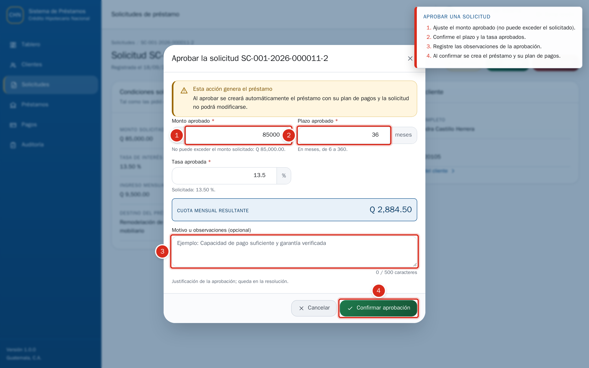
*Figura 13. Formulario de aprobación de la solicitud.*

Los números de la Figura 13 señalan:

1. **Ajuste el monto aprobado** (no puede exceder el solicitado).
2. **Confirme el plazo y la tasa aprobados.**
3. **Registre las observaciones de la aprobación**, en el campo *Motivo u observaciones (opcional)*.
4. **Al confirmar se crea el préstamo y su plan de pagos**, con el botón *Confirmar aprobación*.

Detalles que conviene tener presentes:

- Los tres campos llegan **ya llenos** con lo que pidió el cliente. Si está de acuerdo con esas condiciones, no cambie nada: lo que el analista no modifique se aprueba tal como se solicitó.
- El **monto aprobado no puede superar el monto solicitado**. Puede aprobar menos (por ejemplo, Q 60,000.00 sobre Q 85,000.00 solicitados), pero nunca más. El sistema muestra el límite bajo el campo y rechaza la operación si se excede.
- Mientras escribe, el recuadro *Cuota mensual resultante* le muestra cuánto pagaría el cliente con las condiciones que está aprobando.
- La ventana le recuerda: *«Al aprobar se creará automáticamente el préstamo con su plan de pagos y la solicitud no podrá modificarse»*.

> **Importante.** Al confirmar la aprobación, el sistema crea **por sí solo** el préstamo: le asigna su número oficial (por ejemplo `PR-001-2026-000005-0`), calcula la cuota mensual y genera el plan completo de amortización. No hay que registrar el préstamo a mano. Como la solicitud queda cerrada, revise bien el monto, el plazo y la tasa antes de confirmar.

### 7.5 Rechazar una solicitud

En el detalle de la solicitud pulse **Rechazar** (número 3 de la Figura 12). Se abre la ventana *Rechazar la solicitud &lt;número&gt;*.

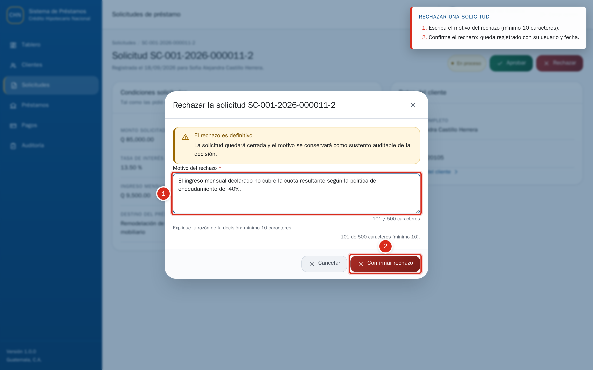
*Figura 14. Formulario de rechazo de la solicitud.*

Los números de la Figura 14 señalan:

1. **Escriba el motivo del rechazo** (mínimo 10 caracteres).
2. **Confirme el rechazo**, con el botón *Confirmar rechazo*: queda registrado con su usuario y la fecha.

Sobre el motivo:

- Es **obligatorio** y debe tener **entre 10 y 500 caracteres**. Un contador debajo del campo le indica cuántos caracteres ha escrito y, si aún no alcanza el mínimo, cuántos le faltan.
- Escriba una razón comprensible para quien lea el expediente después. Por ejemplo: «La cuota mensual excede el 40 % del ingreso declarado».
- El motivo queda guardado en la resolución y en la bitácora de auditoría, junto con su usuario y la fecha.

> **Nota.** El rechazo es **definitivo**: la solicitud queda cerrada y no se puede reabrir. Si el cliente mejora sus condiciones y vuelve a pedir el préstamo, registre una **solicitud nueva**.

### 7.6 Consultar la resolución

Una vez resuelta, el detalle de la solicitud muestra el bloque **Resolución**.

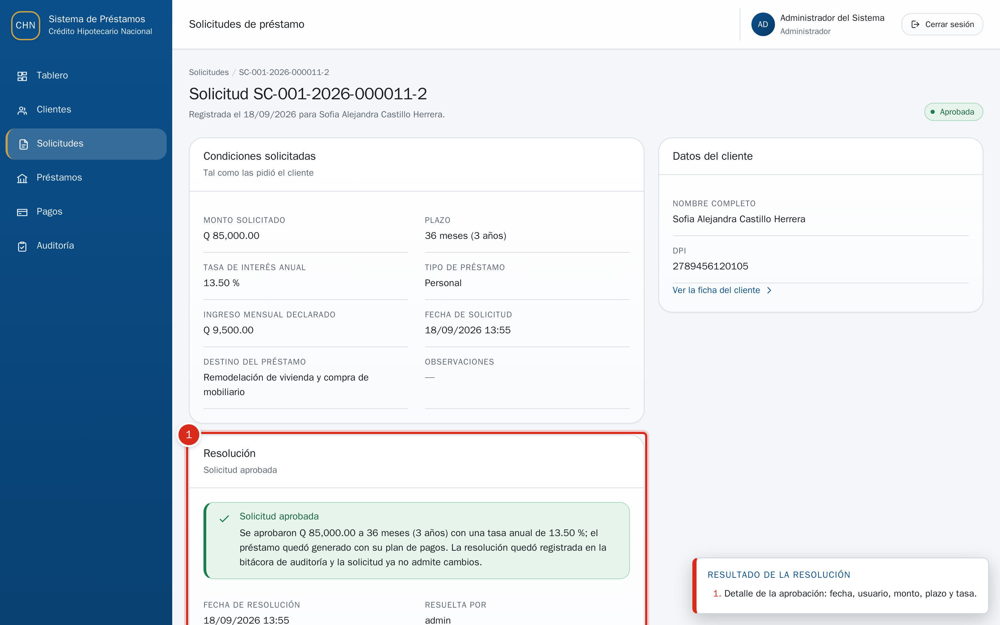
*Figura 15. Solicitud aprobada con su resolución.*

El número de la Figura 15 señala:

1. **Detalle de la aprobación:** fecha, usuario, monto, plazo y tasa.

En este bloque encontrará la *Fecha de resolución*, quién la resolvió (*Resuelta por*), el *Monto aprobado*, el *Plazo aprobado*, la *Tasa aprobada* y el *Motivo*. Cuando la solicitud fue aprobada, aparece además el número del **préstamo generado** con su cuota mensual y el enlace **Ver el préstamo**, que lo lleva directamente al expediente del préstamo.

En la parte superior, un aviso le recuerda: *«Esta solicitud ya fue aprobada y no admite cambios. La resolución queda registrada en la bitácora de auditoría»*.

---

## 8. Préstamos aprobados

Un préstamo nace al aprobar una solicitud. Aquí se consulta el dinero desembolsado, lo que el cliente ya pagó y lo que le falta.

### 8.1 Consultar la cartera de préstamos

En el menú lateral pulse **Préstamos**.

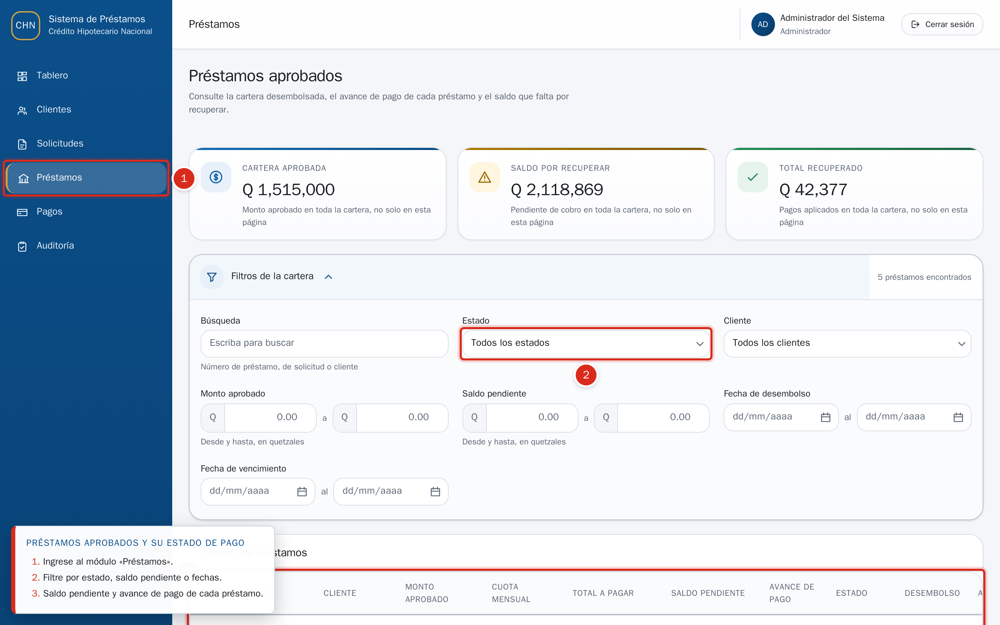
*Figura 16. Listado de préstamos aprobados.*

Los números de la Figura 16 señalan:

1. **Ingrese al módulo «Préstamos»** desde el menú lateral.
2. **Filtre por estado, saldo pendiente o fechas** en el panel de filtros: *Estado* separa los vigentes de los liquidados, *Cliente* limita la lista a una persona, y los rangos acotan por monto aprobado, por saldo pendiente, por fecha de desembolso y por fecha de vencimiento.
3. **Saldo pendiente y avance de pago de cada préstamo**, en las columnas de la tabla.

Arriba verá tres indicadores de toda la cartera: *Cartera aprobada*, *Saldo pendiente total* y *Total recuperado*.

> **Para la gestión de cobro.** Escriba un importe en *Saldo pendiente desde* y deje vacío el otro extremo: el listado se queda con los préstamos que más dinero deben. Es la forma rápida de preparar la lista de llamadas del día.

La tabla muestra las columnas *No. de préstamo*, *Cliente*, *Monto aprobado*, *Cuota mensual*, *Total a pagar*, *Saldo pendiente*, *Avance de pago*, *Estado* y *Desembolso*.

Cómo leerlas:

- **Saldo pendiente** es lo que el cliente **todavía debe**: el monto total a pagar menos todo lo que ya pagó. Es la cifra que se cobra en ventanilla.
- **Avance de pago** es la barra de progreso: qué parte de la deuda total ya está cubierta. Una barra al 20 % significa que el cliente ha pagado la quinta parte de todo lo que debe pagar.
- **Estado** es *Vigente* (aún debe) o *Liquidado* (ya terminó de pagar).

El botón **Ver** abre el detalle. Si su perfil registra pagos y el préstamo está vigente, aparece también el botón **Registrar pago**.

### 8.2 El detalle del préstamo

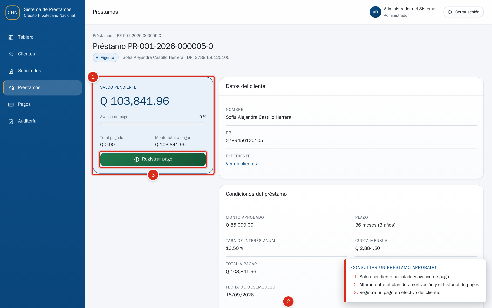
*Figura 17. Detalle de un préstamo.*

Los números de la Figura 17 señalan:

1. **Saldo pendiente calculado y avance de pago**, en la tarjeta grande de la izquierda.
2. **Alterne entre el plan de amortización y el historial de pagos** con las dos pestañas.
3. **Registre un pago en efectivo del cliente** con el botón *Registrar pago*.

El detalle reúne toda la información del préstamo:

- **Tarjeta de saldo.** El *Saldo pendiente* en grande, la barra de *Avance de pago*, el *Total pagado* y el *Monto total a pagar*.
- **Datos del cliente.** Nombre, DPI y un enlace a su expediente.
- **Condiciones del préstamo.** *Monto aprobado*, *Plazo*, *Tasa de interés anual*, *Cuota mensual*, *Total a pagar*, *Total de intereses*, *Fecha de desembolso*, *Fecha de vencimiento* y la *Solicitud de origen* (que es un enlace a la solicitud que lo generó).
- **Dos pestañas:** *Plan de amortización* e *Historial de pagos*.

### 8.3 El plan de amortización

Es el calendario de pagos pactado al desembolsar el préstamo: cuota por cuota, desde la primera hasta la última.

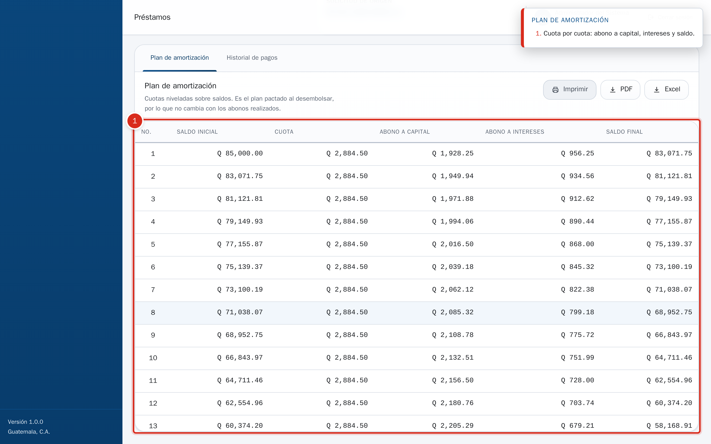
*Figura 18. Plan de amortización del préstamo.*

El número de la Figura 18 señala:

1. **Cuota por cuota: abono a capital, intereses y saldo.**

La tabla tiene estas columnas:

| Columna | Qué le dice |
|---|---|
| **No.** | El número de la cuota: 1 es la primera, 2 la segunda, y así hasta el final del plazo. |
| **Saldo inicial** | Cuánto se debía antes de pagar esa cuota. |
| **Cuota** | Lo que se paga ese mes. Es siempre la misma cantidad. |
| **Abono a capital** | La parte de la cuota que **reduce la deuda**. |
| **Abono a intereses** | La parte de la cuota que se queda el banco como **costo del préstamo**. No reduce la deuda. |
| **Saldo final** | Cuánto se sigue debiendo después de pagar esa cuota. |

La última fila, **Totales**, suma la cuota, el abono a capital y el abono a intereses de todo el plan.

> **En palabras sencillas: ¿capital o intereses?**
> Imagine que la cuota es un billete que se parte en dos. Una parte, el **abono a capital**, va a bajar la deuda: es dinero que el cliente recupera en forma de deuda que desaparece. La otra parte, el **abono a intereses**, es el precio de haber recibido el dinero prestado: no baja la deuda, es el cobro del banco por el servicio.
> Al principio del préstamo la cuota lleva **muchos intereses y poco capital**, porque se debe mucho. A medida que la deuda baja, los intereses bajan con ella y cada cuota reduce más la deuda. La cuota mensual, en cambio, nunca cambia.

Un aviso en la pantalla le recuerda que el plan es el **pactado al desembolsar**, por lo que **no cambia** con los abonos que se vayan registrando: sirve como referencia de lo acordado.

**Para imprimir el plan**, pulse el botón **Imprimir** que está arriba a la derecha de la tabla y confirme en la ventana de impresión del navegador. También puede guardarlo como archivo PDF eligiendo esa opción como impresora.

---

## 9. Registrar pagos en efectivo

Todos los pagos que gestiona el sistema son **en efectivo**, recibidos en ventanilla. Cada pago genera un recibo de caja con su número oficial, por ejemplo `RC-001-2026-000008-9`.

### 9.1 Registrar un pago

Hay tres caminos para llegar al formulario:

- Desde el menú lateral **Pagos** → botón **Registrar pago**.
- Desde el listado de **Préstamos** → botón **Registrar pago** de la fila.
- Desde el **detalle del préstamo** → botón **Registrar pago** de la tarjeta de saldo.

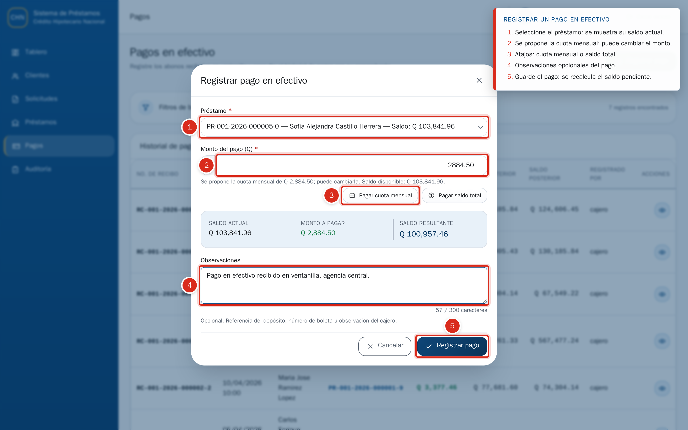
*Figura 19. Formulario de registro de un pago.*

Los números de la Figura 19 señalan:

1. **Seleccione el préstamo:** se muestra su saldo actual. La lista solo incluye préstamos **vigentes**, e indica el número de préstamo, el nombre del cliente y su saldo. Si es larga, escriba en su cuadro de búsqueda parte del número o del nombre del cliente ([3.4](#34-elegir-en-una-lista-desplegable)).
2. **Monto del pago:** al elegir el préstamo, el sistema propone la **cuota mensual**. Si el cliente paga otra cantidad, escríbala encima; no puede exceder el saldo.
3. **Atajos de monto:** *Pagar cuota mensual* vuelve a poner la cuota y *Pagar saldo total* pone el saldo completo.
4. **Observaciones opcionales del pago**, por ejemplo la referencia del depósito o el número de boleta.
5. **Guarde el pago** con el botón *Registrar pago*: se recalcula el saldo pendiente.

Mientras captura el monto, un recuadro le muestra en vivo el **Saldo actual**, el **Monto a pagar** y el **Saldo resultante**, para que confirme el efecto del pago antes de guardarlo.

En el último pago, si el saldo pendiente es menor que la cuota, el sistema propone el saldo y no la cuota completa.

**Para cobrar todo el saldo de una vez**, pulse el botón **Pagar saldo total**: el sistema llena el campo del monto con el saldo exacto del préstamo, hasta el último centavo. Verá entonces el aviso *«Con este pago el préstamo queda liquidado»*.

> **El sistema no permite pagar más de lo que se debe.** Si escribe un monto mayor al saldo, aparece el mensaje *«El monto no puede exceder el saldo pendiente de Q …»* y el pago no se guarda. El monto tampoco puede ser cero ni negativo. Compruebe siempre el efectivo recibido antes de guardar: **un pago registrado no se puede modificar ni anular desde la aplicación**.

Al guardar, el sistema muestra el aviso *«Pago registrado»* con el número de recibo y abre de inmediato el comprobante.

### 9.2 Imprimir el comprobante

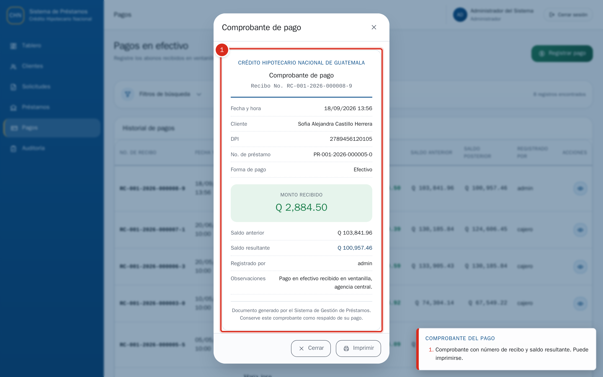
*Figura 20. Comprobante de pago.*

El número de la Figura 20 señala:

1. **Comprobante con número de recibo y saldo resultante. Puede imprimirse.**

El comprobante incluye el nombre de la institución, el número de recibo, la fecha y hora, el cliente y su DPI, el número de préstamo, la forma de pago (*Efectivo*), el **monto recibido**, el **saldo anterior**, el **saldo resultante**, el usuario que lo registró y las observaciones, si se escribieron.

Para entregarlo al cliente, pulse el botón **Imprimir** al pie de la ventana y confirme en la ventana de impresión del navegador. Si necesita guardarlo en archivo, elija «Guardar como PDF» como impresora.

Puede reimprimir el comprobante de cualquier pago en cualquier momento: vaya a **Pagos** y pulse **Ver comprobante** en la fila del recibo.

### 9.3 Consultar el historial de pagos

Hay dos lugares para consultar los pagos.

**a) Todos los pagos del sistema.** En el menú lateral pulse **Pagos**.

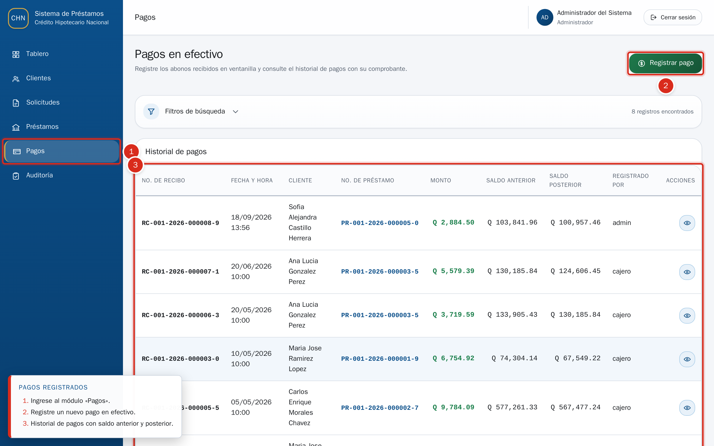
*Figura 21. Historial general de pagos.*

Los números de la Figura 21 señalan:

1. **Ingrese al módulo «Pagos»** desde el menú lateral.
2. **Registre un nuevo pago en efectivo** con el botón *Registrar pago*.
3. **Historial de pagos con saldo anterior y posterior**, en la tabla.

La tabla muestra las columnas *No. de recibo*, *Fecha y hora*, *Cliente*, *No. de préstamo*, *Monto*, *Saldo anterior*, *Saldo posterior* y *Registrado por*.

En el panel de filtros puede acotar la lista por número de recibo, cliente, préstamo, rango de monto, **fecha de pago** y usuario que registró el cobro. Para **cuadrar la caja de un día**, ponga la misma fecha en los dos extremos del periodo: el listado mostrará solo los recibos de esa jornada. El botón *Limpiar filtros* devuelve la lista a su estado completo.

El par **Saldo anterior / Saldo posterior** es la mejor herramienta de control: dice cuánto se debía antes del pago y cuánto se debía después. La diferencia entre ambos es exactamente el monto recibido.

**b) Los pagos de un préstamo.** En el detalle del préstamo, pulse la pestaña **Historial de pagos**.

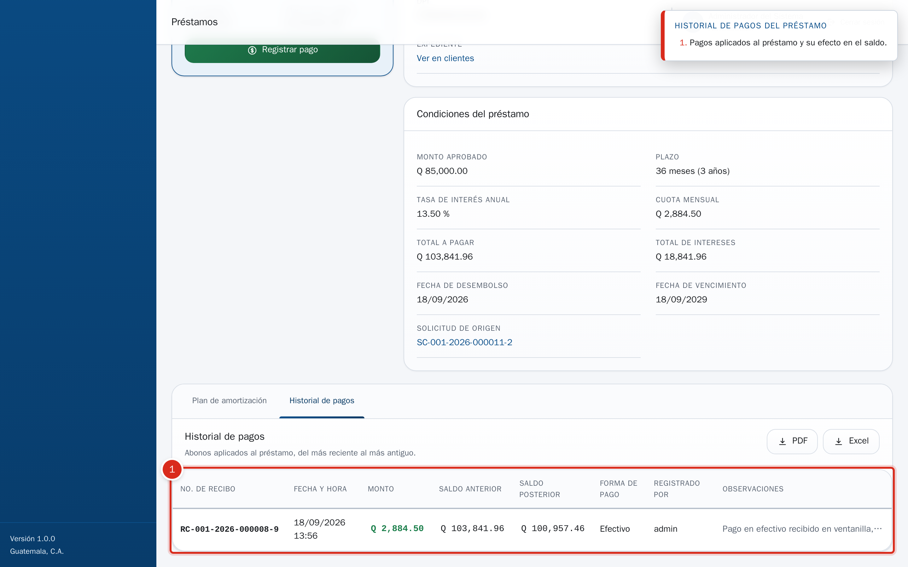
*Figura 22. Historial de pagos de un préstamo.*

El número de la Figura 22 señala:

1. **Pagos aplicados al préstamo y su efecto en el saldo.**

Los abonos se listan del más reciente al más antiguo, con el número de recibo, la fecha y hora, el monto, el saldo anterior, el saldo posterior, la forma de pago, quién lo registró y las observaciones.

### 9.4 Cuando el préstamo queda liquidado

Cuando un pago deja el saldo en **Q 0.00**, el préstamo pasa automáticamente al estado **Liquidado**:

- El sistema muestra el aviso *«Préstamo liquidado: el saldo quedó en cero; el préstamo ya no admite más pagos»*.
- En el detalle del préstamo aparece un mensaje verde de **Préstamo liquidado** y desaparece el botón *Registrar pago*.
- El préstamo deja de aparecer en la lista de préstamos disponibles del formulario de pagos.
- Si alguien intenta registrar otro pago sobre él, el sistema responde *«El préstamo ya está liquidado»*.
- El plan de amortización y el historial de pagos se conservan como respaldo y se pueden consultar e imprimir siempre.

---

## 10. Bitácora de auditoría

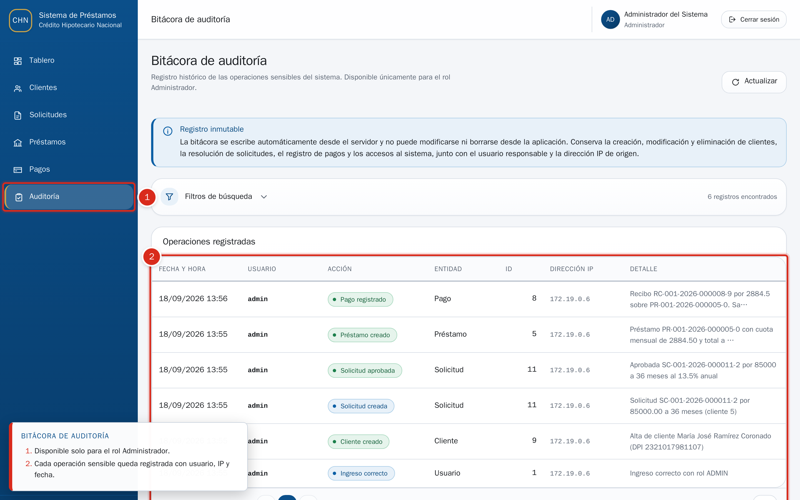
*Figura 23. Bitácora de auditoría.*

Los números de la Figura 23 señalan:

1. **Disponible solo para el rol Administrador**: la opción *Auditoría* del menú lateral no aparece para los demás perfiles.
2. **Cada operación sensible queda registrada con usuario, IP y fecha.**

**Para qué sirve.** La bitácora responde a la pregunta «¿quién hizo esto y cuándo?». Guarda el registro histórico de las operaciones delicadas del sistema: el alta, la modificación y la eliminación de clientes, la resolución de solicitudes, el registro de pagos y los accesos al sistema, incluidos los intentos fallidos de ingreso.

La tabla muestra las columnas *Fecha y hora*, *Usuario*, *Acción*, *Entidad*, *ID*, *Dirección IP* y *Detalle*. Si el detalle es largo, coloque el puntero sobre el texto para verlo completo. El botón **Actualizar** recarga la lista.

Para aclarar un caso concreto, use el panel de filtros: puede acotar por *Usuario*, por *Acción* (por ejemplo, solo los clientes eliminados), por *Entidad* y por un periodo de fechas, y buscar texto libre en el detalle. Así se responde en segundos a preguntas como «¿quién borró este expediente el martes pasado?».

**Quién puede verla.** Únicamente el perfil **Administrador**. Los perfiles Analista de crédito, Cajero y Consulta no tienen acceso a esta pantalla.

> **Nota.** La bitácora es un **registro inmutable**: la escribe el sistema por su cuenta y **no se puede modificar ni borrar** desde la aplicación. Por eso es la referencia para aclarar cualquier duda sobre una operación.

---

## 11. Uso desde el teléfono

El sistema funciona igual desde un teléfono o una tableta: abra el navegador del dispositivo y escriba la misma dirección, **http://localhost:8080**.

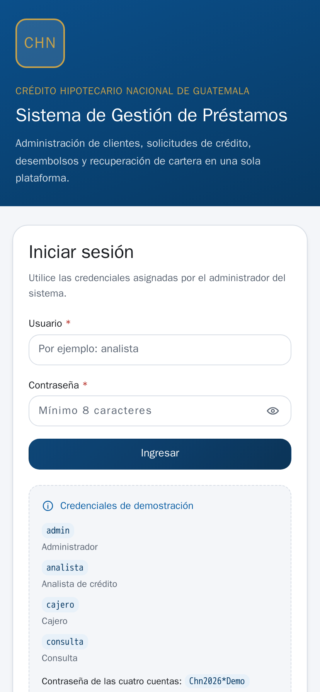
*Figura 24. El sistema en la pantalla de un teléfono.*

Lo que cambia en la pantalla pequeña:

- El menú lateral se oculta para dejar sitio al contenido. Para abrirlo, pulse el botón de las **tres líneas** que está arriba a la izquierda; para cerrarlo, pulse fuera del menú o el mismo botón.
- Las tarjetas de indicadores y los paneles de gráficas del Tablero se acomodan uno debajo de otro; en el anillo de *Solicitudes por estado*, la leyenda pasa debajo del dibujo.
- Las tablas se pueden **desplazar hacia los lados** con el dedo para ver todas las columnas.
- Las listas desplegables se abren **dentro de la propia página**, no con el selector del teléfono, y se recorren con el dedo; cuando son largas siguen trayendo su cuadro de búsqueda, que en una pantalla pequeña es la forma más rápida de llegar a un cliente ([3.4](#34-elegir-en-una-lista-desplegable)).
- Los formularios y las ventanas de confirmación ocupan todo el ancho de la pantalla.

Todas las funciones están disponibles, pero para capturar formularios largos (una solicitud nueva, por ejemplo) o revisar un plan de amortización completo resulta más cómodo trabajar en una computadora.

---

## 12. Preguntas frecuentes

**1. No veo el botón para eliminar un cliente. ¿Por qué?**
Porque eliminar clientes es una acción reservada al perfil **Administrador**. Si su perfil es Analista de crédito, Cajero o Consulta, el icono de la papelera no aparece. Solicite la baja al administrador del sistema.

**2. No puedo registrar un pago: el botón no aparece.**
Puede haber dos razones. La primera, que su perfil no lo permita: solo **Administrador** y **Cajero** registran pagos. La segunda, que el préstamo ya esté **liquidado**: cuando el saldo llega a cero, el préstamo no admite más pagos y el botón desaparece.

**3. El sistema me sacó y dice que mi sesión expiró. ¿Qué hago?**
Por seguridad, la sesión tiene una duración limitada y se cierra tras un tiempo prolongado sin actividad. Vuelva a ingresar con su usuario y su contraseña. Lo que ya había guardado está a salvo; lo que estaba capturando en un formulario sin guardar deberá escribirlo de nuevo.

**4. El sistema rechaza el DPI que estoy escribiendo. ¿Por qué?**
Por una de estas tres razones: no tiene **exactamente 13 dígitos**; lo escribió con guiones o espacios (escríbalo solo con números); o ya existe otro cliente registrado con ese mismo DPI. En el último caso, busque el DPI en el listado de clientes: es probable que el expediente ya esté creado.

**5. Me dice que el correo electrónico ya existe.**
Cada cliente debe tener un correo distinto. Busque ese correo en el listado de clientes para ver a quién pertenece. Si el cliente realmente no tiene correo propio, solicite al cliente una dirección personal; no reutilice la de otra persona.

**6. Registré mal el monto de un pago. ¿Cómo lo corrijo?**
**No se puede corregir ni anular un pago desde la aplicación**, precisamente para que el historial de un préstamo no pueda alterarse. El procedimiento correcto es: 1) no registre otro pago para «compensar» el error; 2) informe de inmediato a su jefe de agencia y al **administrador del sistema**, indicando el número de recibo, el número de préstamo y el monto correcto; 3) conserve el comprobante impreso y el efectivo como respaldo. La corrección la hará el administrador conforme al procedimiento interno de la institución, y quedará registrada en la bitácora de auditoría.

**7. ¿Por qué no puedo modificar una solicitud que ya fue aprobada o rechazada?**
Porque una solicitud resuelta es una decisión formal ya tomada, y en el caso de la aprobación ya generó un préstamo con su plan de pagos. Permitir cambios haría imposible saber qué se autorizó en realidad. Si las condiciones deben cambiar, registre una **solicitud nueva**.

**8. Aprobé por error una solicitud. ¿Puedo deshacerlo?**
No desde la aplicación. La aprobación crea el préstamo y cierra la solicitud. Comuníquese con el administrador del sistema indicando el número de solicitud y el número de préstamo generado.

**9. El cliente que necesito no aparece en la lista al crear una solicitud.**
La lista solo incluye clientes ya registrados. Vaya al módulo **Clientes**, búsquelo por nombre o DPI y, si no existe, regístrelo (sección 6.2). Después vuelva a crear la solicitud. Recuerde que también puede escribir parte del nombre o del DPI en el campo *Buscar cliente*, o en el cuadro de búsqueda que trae la propia lista al abrirla, para filtrar una lista larga ([3.4](#34-elegir-en-una-lista-desplegable)).

**10. La simulación dice «No recomendado». ¿El sistema me impide aprobar?**
No. La evaluación de capacidad de pago es **orientativa**: avisa de que la cuota compromete más del 40 % del ingreso declarado o de que el cliente ya tiene tres o más préstamos vigentes. La decisión es del analista, según las políticas de crédito de la institución.

**11. ¿Por qué el monto aprobado no puede ser mayor que el solicitado?**
Porque el banco no puede otorgar más de lo que el cliente pidió formalmente. Sí se puede aprobar menos. Si el cliente necesita más dinero, debe presentar una solicitud nueva por el monto mayor.

**12. Escribí mal la contraseña varias veces y ahora no me deja entrar.**
Tras **cinco intentos fallidos** la cuenta se bloquea **15 minutos**. Espere ese tiempo y vuelva a intentarlo, o pida al administrador que le restablezca la contraseña.

**13. ¿Por qué el saldo pendiente no coincide con la suma de las cuotas que faltan en el plan?**
El plan de amortización es el calendario **pactado al desembolsar** y no se recalcula con los abonos. El saldo pendiente, en cambio, es una cifra viva: es el monto total a pagar menos todo lo que el cliente ha pagado. Si el cliente abonó cantidades distintas a la cuota, las dos cifras no tienen por qué coincidir. Para cobrar, use siempre el **saldo pendiente**.

**14. El sistema no responde o muestra que no se pudo conectar.**
Compruebe que la dirección sea la correcta y que su computadora tenga conexión. Pulse el botón **Reintentar** que aparece en el aviso, o recargue la página con la tecla `F5`. Si el problema continúa, avise al personal técnico: el sistema puede estar fuera de servicio momentáneamente.

**15. ¿Puedo imprimir la información que veo en pantalla?**
Sí. El plan de amortización y el comprobante de pago tienen su propio botón **Imprimir**. Cualquier otra pantalla se puede imprimir con la opción de impresión del navegador (`Ctrl + P`), eligiendo «Guardar como PDF» si prefiere un archivo.

**16. No encuentro a un cliente que sé que existe. ¿Qué puede estar pasando?**
Casi siempre hay un **filtro puesto** de una consulta anterior. Mire la barra *Filtros de búsqueda*: si aparece la etiqueta *«1 filtro aplicado»* (o más) y unas pastillas debajo, el listado no le está mostrando todo. Pulse la **X** de cada pastilla, o el botón *Limpiar filtros*. Compruebe también que la barra de búsqueda esté vacía. Si aun así no aparece, busque solo por el apellido o por los primeros dígitos del DPI: no hace falta escribir tildes ni respetar las mayúsculas, pero un apellido mal capturado sí impide encontrarlo.

**17. ¿Cómo veo solo los préstamos con saldo alto?**
Entre en **Préstamos**, despliegue *Filtros de búsqueda* y escriba el importe que le interese en **Saldo pendiente desde** (por ejemplo Q 50,000.00), dejando vacío el otro extremo. El listado se queda con los préstamos que más deben. Si además quiere descartar los ya pagados, ponga el *Estado* en *Vigente*. Es la forma habitual de preparar la gestión de cobro.

**18. El listado cambió solo, sin que yo pulsara nada. ¿Es normal?**
Sí. Los filtros se aplican **en cuanto usted los cambia**: no hay botón de buscar. En los campos donde se escribe, el sistema espera un momento a que termine de teclear y entonces actualiza la tabla. Además, cada vez que cambia un criterio el listado vuelve a la **primera página**, así que no se extrañe si estaba en la página 3 y aparece en la 1.

**19. Puse un filtro sin darme cuenta. ¿Cómo lo quito?**
Cada criterio aplicado se ve como una **pastilla** bajo la barra de filtros, con su nombre y su valor. Pulse la **X** de la pastilla para quitar solo ese criterio, o el botón *Limpiar filtros* para quitarlos todos de una vez. Las pastillas se ven aunque el panel esté cerrado, de modo que siempre puede comprobar qué tiene puesto.

**20. ¿Por qué no puedo escribir una fecha en el campo de nacimiento?**
El campo solo admite números y va poniendo las barras por usted: escriba `15061992` y quedará `15/06/1992`. Si el calendario muestra apagados los días que intenta elegir, es porque esa fecha no está permitida; en el alta de clientes, por ejemplo, no se admite ninguna que corresponda a un menor de 18 años. Vea la [sección 4](#4-elegir-una-fecha).

**21. El porcentaje recuperado del Tablero me parece bajo. ¿Está bien?**
Sí. El porcentaje compara lo cobrado con **todo lo que los clientes pagarán**, capital e intereses, y no solo con el capital aprobado. En un préstamo a varios años los intereses son una parte importante del total, así que el porcentaje avanza más despacio que si se dividiera entre el capital. Vea [Cartera](#cartera) en la sección 2.

**22. En la recaudación mensual, el mes actual casi no tiene columna. ¿Faltan pagos?**
No necesariamente. La columna resaltada es el **mes en curso**, que todavía no ha terminado: solo suma los pagos recibidos hasta hoy. Compare los meses ya cerrados entre sí, y el mes en curso cuando termine. Si necesita la cifra exacta, pase el cursor sobre la columna o pulse *Ver tabla*.

---

## 13. Mensajes del sistema

### El color del aviso ya le dice qué pasó

Cada vez que usted guarda, aprueba, rechaza o elimina algo, el sistema responde con un **aviso** en la esquina superior derecha de la pantalla. El aviso entra deslizándose desde la derecha y va **entero del color de la noticia**, así que no hace falta leerlo para saber si la operación salió bien.

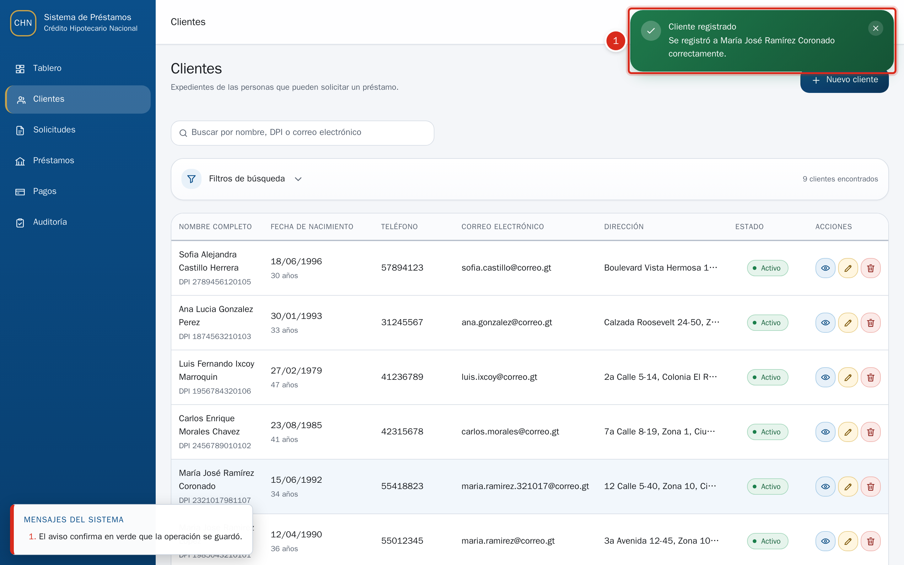
*Figura 25. Aviso de operación realizada con éxito.*

El número de la Figura 25 señala:

1. **El aviso confirma en verde que la operación se guardó.**

| Color del aviso | Título que suele llevar | Qué significa |
|---|---|---|
| **Verde** | *Operación exitosa* | La operación se guardó. Por ejemplo: *«Cliente registrado»*, *«Pago registrado»*, *«Solicitud aprobada»*. No hay nada más que hacer. |
| **Rojo** | *No se pudo completar* | La operación **no** se guardó. El texto explica el motivo. Corrija lo que indica y vuelva a intentarlo. |
| **Ámbar** | *Atención* | Algo merece su atención antes de seguir, aunque la operación no haya fallado. Léalo con calma. |
| **Azul** | *Información* | Un dato útil, sin consecuencias. Por ejemplo, que un préstamo quedó liquidado. |

Cómo se comporta el aviso:

- **Se cierra solo** a los pocos segundos. Una barra en su parte inferior se va vaciando y le indica el tiempo que le queda.
- **Puede cerrarlo antes** con la **X** de su esquina, si ya lo leyó o si le tapa algo.
- Si se le pasó un aviso rojo y no sabe qué ocurrió, vuelva a intentar la operación: el mensaje aparecerá de nuevo.

> **Los mensajes que no desaparecen.** Además de estos avisos, algunas pantallas muestran recuadros fijos del mismo color (verde, rojo, ámbar o azul) con una franja lateral. Esos **no** se cierran solos: se quedan mientras la situación exista, como el recuadro verde de *Préstamo liquidado* o el rojo que aparece cuando no se pudo cargar un listado.

### Qué hacer ante cada mensaje

Estos son los avisos que puede encontrar, qué significan y qué hacer en cada caso.

| Mensaje en pantalla | Qué significa | Qué debe hacer |
|---|---|---|
| **Credenciales inválidas** | El usuario no existe, está desactivado o la contraseña no es la correcta. Por seguridad el sistema no indica cuál de los tres casos es. | Revise que el usuario esté bien escrito y vuelva a escribir la contraseña con cuidado. Si no lo recuerda, pida apoyo al administrador. |
| **La cuenta está bloqueada temporalmente por intentos fallidos. Intente de nuevo más tarde o contacte al administrador.** | Se escribió mal la contraseña cinco veces seguidas y la cuenta quedó bloqueada 15 minutos. | Espere 15 minutos y vuelva a intentarlo, o pida al administrador que la desbloquee. |
| **Demasiados intentos de inicio de sesión. Intente de nuevo en unos minutos.** | Se hicieron muchos intentos de ingreso desde la misma computadora en poco tiempo. | Espere unos minutos antes de volver a intentar. |
| **Su sesión expiró. Inicie sesión nuevamente.** | Pasó demasiado tiempo desde que ingresó, o la sesión se cerró por seguridad. | Vuelva a ingresar con su usuario y contraseña, y capture de nuevo lo que no había guardado. |
| **Ya existe un cliente con el número de identificación …** | El DPI que está capturando ya pertenece a otro expediente. | Busque ese DPI en el listado de clientes: el expediente probablemente ya existe. Verifique el número con el documento del cliente. |
| **Ya existe un cliente con el correo electrónico …** | Ese correo ya está asignado a otro cliente. | Solicite al cliente una dirección de correo propia, o verifique si el cliente ya está registrado. |
| **El cliente debe ser mayor de edad (18 años cumplidos)** | La fecha de nacimiento capturada corresponde a una persona menor de 18 años. | Compruebe la fecha en el DPI del cliente. Si el cliente es menor de edad, no puede registrarse. |
| **El monto debe estar entre Q 1,000 y Q 5,000,000** | El monto solicitado está fuera del rango permitido por la institución. | Corrija el monto dentro del rango. Recuerde escribirlo sin signos ni letras y con un máximo de dos decimales. |
| **El plazo debe estar entre 6 y 360 meses** | El plazo capturado está fuera del rango permitido. | Escriba un plazo entre 6 y 360 meses, en números enteros (sin decimales). |
| **El motivo debe tener entre 10 y 500 caracteres** | El motivo del rechazo es demasiado corto (o demasiado largo). | Amplíe la explicación hasta alcanzar al menos 10 caracteres. El contador bajo el campo le indica cuántos faltan. |
| **La solicitud ya fue resuelta y no admite cambios de estado** | Alguien ya aprobó o rechazó esa solicitud, quizá desde otra computadora. | Recargue la pantalla para ver la resolución vigente. Si las condiciones deben cambiar, registre una solicitud nueva. |
| **El monto del pago excede el saldo pendiente del préstamo. Saldo disponible: Q …** | Está intentando cobrar más de lo que el cliente debe. | Corrija el monto. Si el cliente quiere liquidar el préstamo, use el botón *Pagar saldo total*. |
| **El préstamo ya está liquidado** | El préstamo no tiene saldo: terminó de pagarse y no admite más abonos. | No registre el pago. Verifique con el cliente: puede tratarse de otro préstamo suyo. |
| **No cuenta con los permisos necesarios para ejecutar esta operación** | Su perfil no está autorizado para esa acción. | Consulte la tabla de perfiles de este manual y solicite la operación a quien corresponda. |
| **No se pudo conectar con el servidor. Verifique su conexión e intente de nuevo.** | El sistema no pudo comunicarse con el servidor. | Compruebe su conexión, pulse *Reintentar* o recargue la página. Si continúa, avise al personal técnico. |
| **El servidor tardó demasiado en responder. Intente de nuevo.** | La respuesta tardó más de lo esperado. | Vuelva a intentar la operación en unos momentos. |
| **Este campo es obligatorio.** | Un campo necesario quedó vacío. | Complete el campo señalado en rojo y vuelva a guardar. |
| **La fecha inicial del rango … no puede ser posterior a la fecha final.** | En un filtro de fechas, el día inicial es más tarde que el final. | Corrija una de las dos fechas. Recuerde que la primera casilla es el día inicial y la segunda el final. |
| **El monto mínimo del rango … no puede ser mayor que el monto máximo.** | En un filtro de importes, escribió un mínimo mayor que el máximo (lo mismo se aplica al plazo). | Intercambie los dos valores, o deje vacío el extremo que no necesite acotar. |

---

## 14. Glosario

| Término | Significado |
|---|---|
| **Amortización** | El proceso de ir pagando un préstamo poco a poco, con cuotas periódicas, hasta que la deuda desaparece. |
| **Plan de amortización** | La tabla que muestra, cuota por cuota, cuánto se paga, cuánto baja la deuda, cuánto se paga de intereses y cuánto se sigue debiendo. |
| **Capital** | El dinero prestado, sin contar los intereses. La parte de la cuota que va a capital es la que realmente reduce la deuda. |
| **Interés** | El cobro que hace el banco por prestar el dinero. Es el precio del préstamo y no reduce la deuda. |
| **Tasa nominal anual** | El porcentaje anual con el que se calculan los intereses. Si es 12 % anual, para calcular la cuota se usa la doceava parte cada mes (1 %). |
| **Cuota** | La cantidad fija que el cliente paga cada mes. Incluye una parte de capital y una parte de intereses. |
| **Sistema francés** | La forma de calcular las cuotas que usa este sistema: todas las cuotas son iguales durante todo el plazo. Al principio pesan más los intereses y al final más el capital. |
| **Plazo** | El tiempo acordado para terminar de pagar el préstamo, expresado en meses (por ejemplo, 36 meses son 3 años). |
| **Saldo pendiente** | Lo que el cliente todavía debe: el monto total a pagar menos todo lo que ya ha pagado. Es la cifra que se cobra en ventanilla. |
| **Monto total a pagar** | La suma de todo lo que el cliente entregará al banco al final del plazo: el capital prestado más todos los intereses. |
| **Total recuperado** | Todo lo que los clientes ya pagaron, capital e intereses. En el Tablero se compara con el total a pagar para obtener el porcentaje recuperado. |
| **Recaudación** | Lo cobrado en un periodo. La gráfica *Recaudación mensual* del Tablero suma los pagos en efectivo de cada mes. |
| **Desembolso** | La entrega del dinero al cliente. La *fecha de desembolso* es el día en que el préstamo empezó a existir. |
| **Vencimiento** | La fecha en la que, según el plan pactado, el préstamo debería quedar totalmente pagado. |
| **Liquidado** | El estado de un préstamo cuyo saldo llegó a cero: terminó de pagarse y ya no admite más pagos. |
| **Vigente** | El estado de un préstamo que todavía tiene saldo por pagar. |
| **Mora** | El atraso en el pago de una cuota respecto de la fecha acordada. Este sistema no calcula recargos por mora: registra los pagos recibidos y el saldo que falta. |
| **Capacidad de pago** | La holgura que tiene el cliente en su presupuesto para asumir la cuota. En este sistema se mide por el porcentaje del ingreso mensual que la cuota comprometería; se recomienda no pasar del 40 %. |
| **DPI** | Documento Personal de Identificación, el documento de identidad de Guatemala. Su número tiene 13 dígitos y en el sistema identifica de forma única a cada cliente. |
| **Número oficial** | El número único que el sistema asigna a cada documento, por ejemplo `PR-001-2026-000004-3`. Se lee por bloques: **tipo de documento** (`SC` solicitud de crédito, `PR` préstamo, `RC` recibo de caja), **agencia** que lo emitió (`001`, oficinas centrales), **año** (`2026`), **correlativo** (`000004`, el cuarto préstamo) y **dígito verificador** (`3`). Ver [Cómo leer un número oficial](#cómo-leer-un-número-oficial). |
| **Correlativo** | La parte consecutiva del número oficial. El sistema la asigna solo, para que ningún documento se repita ni se pierda. |
| **Dígito verificador** | El último dígito del número oficial. Se calcula a partir de los demás, así que un número copiado con un dígito equivocado no corresponde a ningún documento. |
| **Recibo** | El documento que respalda un pago recibido. Cada pago genera un recibo de caja con su número oficial (`RC-…`), su monto y el saldo antes y después del pago. |
| **Comprobante de pago** | La versión imprimible del recibo, que se entrega al cliente como respaldo de su pago. |
| **Solicitud** | La petición formal del cliente: cuánto pide, a qué plazo, con qué tasa y para qué. Puede estar En proceso, Aprobada o Rechazada. |
| **Resolución** | La decisión registrada sobre una solicitud: quién la resolvió, cuándo, con qué condiciones y por qué motivo. |
| **Bitácora de auditoría** | El registro histórico de las operaciones delicadas del sistema, con el usuario responsable, la fecha y el equipo desde el que se hicieron. |
| **Filtro** | Un criterio que acota un listado, por ejemplo «solo los préstamos vigentes» o «los pagos del 15/09/2026». Cuando se ponen varios, el listado muestra los registros que los cumplen todos a la vez. |
| **Pastilla** | La etiqueta que aparece bajo la barra de filtros por cada criterio aplicado, con su nombre y su valor. Lleva una X para quitar ese criterio sin tocar los demás. |
| **Aviso** | El mensaje que el sistema muestra en la esquina superior derecha tras una operación. Va del color de la noticia (verde, rojo, ámbar o azul) y se cierra solo a los pocos segundos. |

---

*Crédito Hipotecario Nacional de Guatemala · Sistema de Gestión de Préstamos · Versión 1.0.0*
